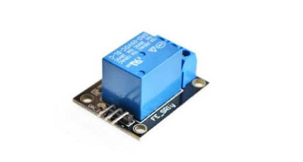
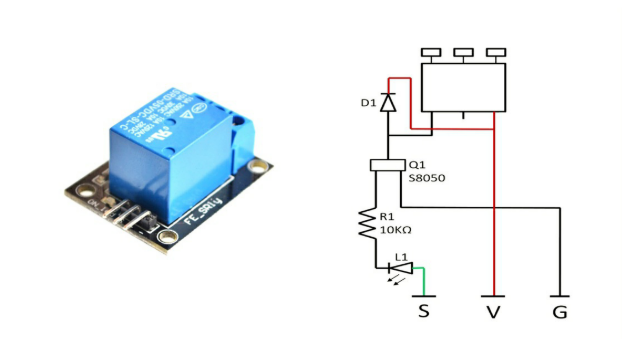

### **Cómo Funciona un rel** ###

Tiene tres terminales de alto voltaje (NC, C y NO) que se conectan al dispositivo que desea controlar. El otro lado tiene tres pines de bajo voltaje (tierra, Vcc y señal) que se conectan al Arduino.


### **Cómo utilizar un rel** ###
Los relés son los dispositivos de conmutación más utilizados en electrónica.

Antes de continuar con el circuito para impulsar el relé, debemos considerar dos parámetros importantes del relé. Una vez que es el voltaje de disparo , este es el voltaje requerido para encender el relé que debe cambiar el contacto de Común-> NC a Común-> NO. Nuestro relé aquí tiene un voltaje de activación de 5 V, pero también puede encontrar relés de valores de 3 V, 6 V e incluso 12 V, así que seleccione uno según el voltaje disponible en su proyecto. El otro parámetro es su Voltaje y Corriente de Carga , esta es la cantidad de voltaje o corriente que el terminal NC, NO o Común del relé podría soportar, en nuestro caso para DC es máximo de 30V y 10A. Asegúrese de que la carga que está usando esté dentro de este rango.



### **Aplicaciones de la retransmisión**

+ De uso común en circuitos de conmutación.
+ Para proyectos de domótica para cambiar cargas de CA
+ Para controlar (encendido / apagado) cargas pesadas en un tiempo / condición predeterminados
+ Se utiliza en circuitos de seguridad para desconectar la carga del suministro en caso de falla
+ Se utiliza en la electrónica de automóviles para controlar indicadores de motores de vidrio, etc.

EXAMPLE SENSOR CODE:

``` 
#include <math.h>

int pinOut = 10;

double Thermistor(int RawADC) {
 double Temp;
 Temp = log(10000.0*((1024.0/RawADC-1))); 
 Temp = 1 / (0.001129148 + (0.000234125 + (0.0000000876741 * Temp * Temp ))* Temp );
 Temp = Temp - 273.15;          
 Temp = (Temp * 9.0)/ 5.0 + 32.0; 
 return Temp;
}

void setup() {
  Serial.begin(9600);
  pinMode(10, OUTPUT);
}

void loop() {             
  int val;                
  double temp;            
  val=analogRead(0);      
  temp=Thermistor(val);   
  Serial.print("Temperature = ");
  Serial.print(temp);   
  Serial.println(" F");
  if (temp >= 150){
    digitalWrite(pinOut, LOW);
  }
  else {
    digitalWrite(pinOut, HIGH);
  }
  delay(500);            
}
``` 
