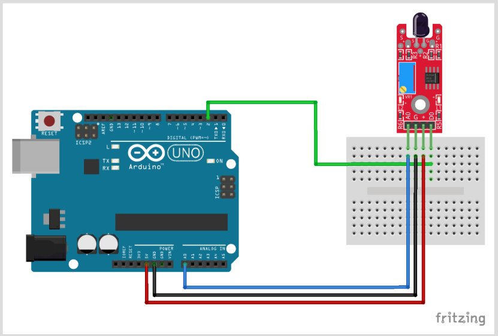
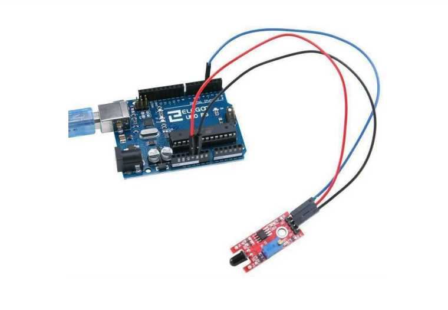
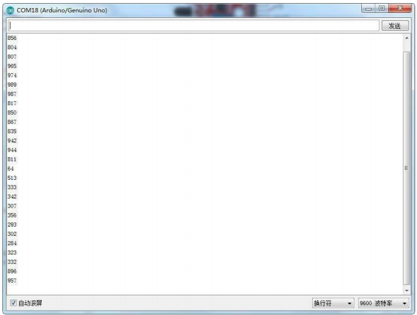

PIC | SENSOR | FUNCIÓN | URL | COLABORADOR
------------ | -------------| -------------| -------------| -------------
 | Flame Sensor | Detecta la luz intraroja emitida por el fuego | [MAS INFO](https://arduinomodules.info/ky-026-flame-sensor-module/#:~:text=KY-026%20Flame%20Sensor%20Module%20for%20Arduino%20detects%20infrared%20light,used%20in%20fire%20detection%20systems.) | Erik Geovanny Osorio Lopez

## DESCRIPTION
Es un módulo de sensor que se utiliza para detectar llamas La sensibilidad espectral del sensor está
optimizada para detectar las emisiones de las llamas. La señal de salida en ‘DO’ pasa a nivel alto cuando
se detecta una llama. El umbral de conmutación se puede ajustar por medio de un potenciómetro preajustado.
En el pin ‘AO’ se encuentra disponible una señal analógica de salida.

- Sensibilidad espectral típica: 720-1100 nm
- Angulo típico de detección: 60°

## COMPONENTES:
- 1 x Elegoo Uno R3 1 x cable USB
- 1 x Modulo sensor de llama 4 x Cables F-M

## EJEMPLO DE CONCECCION ARDUINO:

PIC1 | PIC2 |
------------ | -------------|
 | 

## EXAMPLE SENSOR CODE:
Programa de control del puerto digital

//define el puerto del LED int Led = 13;

//define el puerto del interruptor int buttonpin = 13;

//define digital variable val int val;

void setup()

{

//define el LED como una salida PinMode (Led, OUTPUT);

//define el interruptor como una salida pinMode(buttonpin,INPUT);

}

void loop()

{

//Lee el valor de la interfaz digital 3 asignada a val val=digitalRead(buttonpin);

// cuando el sensor del interruptor tenga señal, el LED destellará if(val==HIGH)

{

digitalWrite(Led,HIGH);

}

else

{

digitalWrite(Led,LOW);

}

}

(2) Simulación de los procedimientos de control de boca

// Selecciona el pin de entrada para el potenciómetro int sensorPin = A0;

// Selecciona el pin para el LED int ledPin = 13;

// Variable para almacenar el valor que viene del sensor intsensorValue =0;

void setup()

{

pinMode(ledPin,OUTPUT); Serial.begin(9600);

}

void loop()

{

sensorValue = analogRead(sensorPin); digitalWrite(ledPin, HIGH); delay(sensorValue); digitalWrite(ledPin,

LOW); delay(sensorValue); Serial.println(sensorValue, DEC);

}

