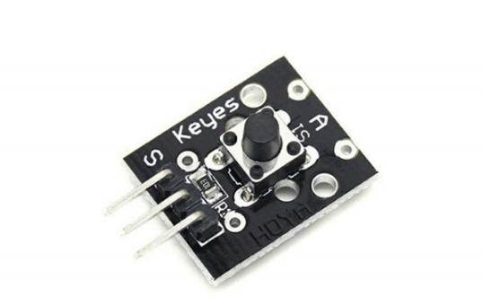
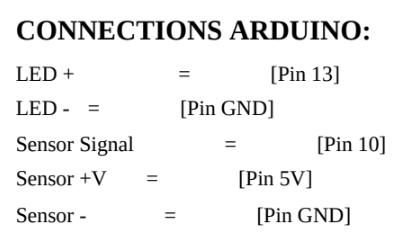
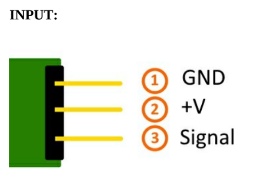

 

## Descripcion

The bottom module known as KY 004. This is a module itself. So
let's get started. This module has integrated on-board a button called
f set 1713 and one resistor. The resistor used in this module is thank
you on and the main reason for using the resistor is to limit current
circulating inside the module. In other words to prevent the current
from burning our module Now I will show how these components
are connected together. There we have the sensor itself and of
course, there is Easter r1 alright you can see how the piece of the
module are connected on this board, we have internet the flow of the
voltage, we have in black, the flow of the ground.
And of course we have in green, the flow of the signal. The button
Episode 70 and 13 has two states pressed or undressed which is his
normal state and have the life cycle of hundred thousand clicks.
When this button is in his normal state, the voltage will stay in first
two legs or pins of the button and the output signal that the module
will give in normal state it will be high. When we press the button
the voltage will pass The other side, and by consequence, changing
the output signal to low. When you release the button it will go out
automatically in his normal state because of the spring inside, who
force the button up. The force that is needed to press a button is
hundred 80 to 230 gam. This module has three pins. The pins in this
module are the ground pin with a minus sign, the voltage pin in the
middle and of course the pain of the signal with an S sign.

PIC1 | PIC2 |
------------ | -------------|
 | 

## EXAMPLE SENSOR CODE:
int led = 13; //Define the LED pin
int buttonpin = 3; //Define the push button pin
int val; //Define a numeric variable
void setup()
{

pinMode(led,OUTPUT);
pinMode(buttonpin,INPUT);

}
void loop()

{

val = digitalRead(buttonpin); // check the state

of the button

if(val==HIGH) // if button is pressed, turn LED

on

{
digitalWrite(led,HIGH);
}
else
{
digitalWrite(led,LOW)
