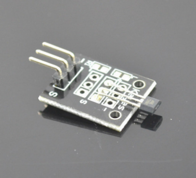

# Class Bihor Magnetic Sensor

|SENSOR   | FUNTION  | COLABORADOR  |  URL |
|---|---|---|---|
| Class Bihor Magnetic Sensor  | he strength of the field is given by an analog voltage at the signal pin of the module KY-035  |  CASTILLO OSCAR | https://tkkrlab.nl/wiki/Arduino_KY-035_Class_Bihor_magnetic_sensor#:~:text=KY-035%20is%20an%20analog,5V%20of%20the%20Arduino%20board.&text=The%20led%20on%20the%20board,strength%20of%20the%20magnetic%20field.  |
