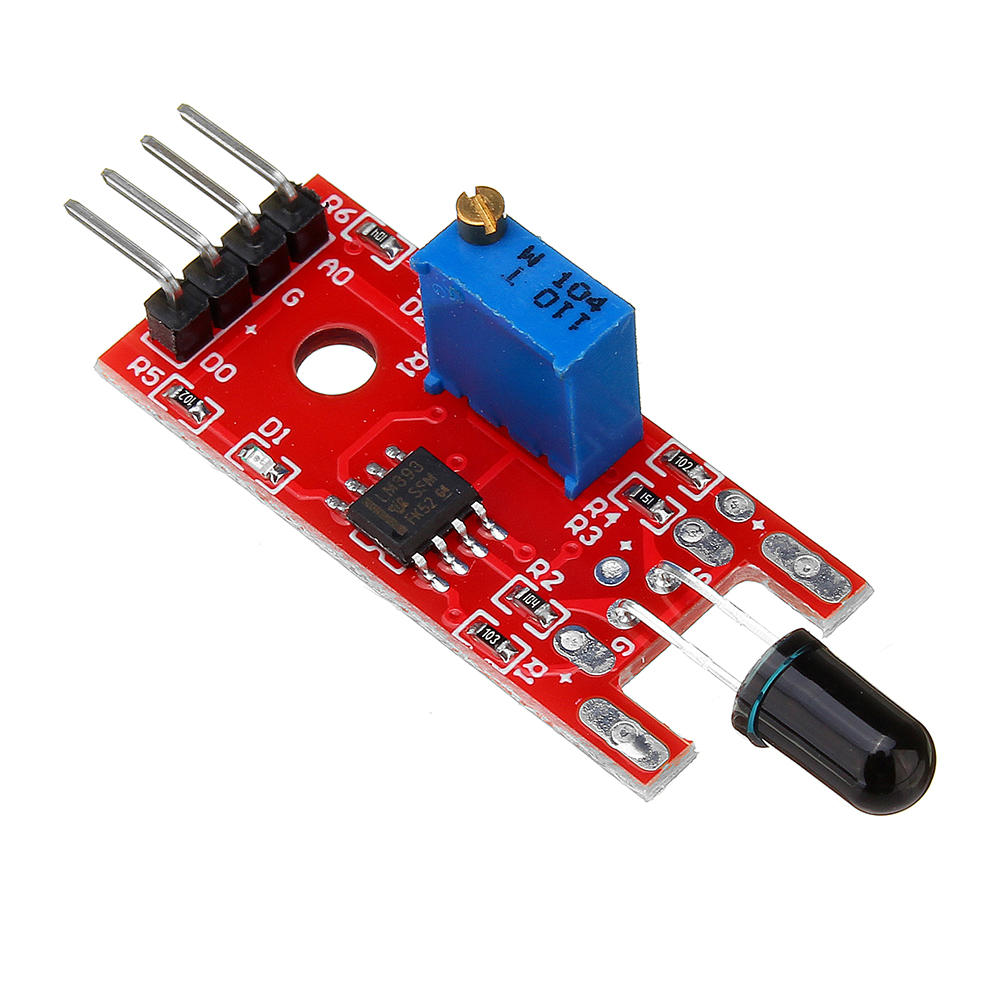
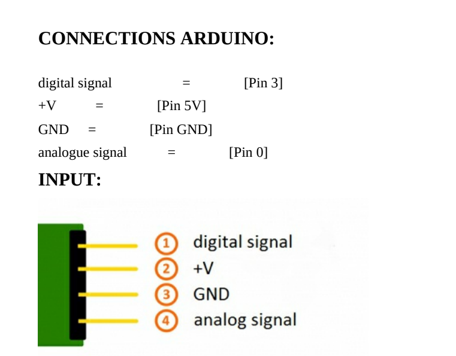

The flame sensor known KY 0 26. This is the module itself.

## EXAMPLE SENSOR CODE:
```ARDUINO
int led = 13; // define the LED pin
int digitalPin = 2; // KY-026 digital interface
int analoguePin = A0; // KY-026 analogue interface
int digitalVal; // digital readings
int analogueVal; //analogue readings
void setup()

{
pinMode(led, OUTPUT);
pinMode(digitalPin, INPUT);
//pinMode(analoguePin, OUTPUT);
Serial.begin(9600);
}
void loop()
{
// Read the digital interface
digitalVal = digitalRead(digitalPin);
if(digitalVal == HIGH) // if flame is detected
{
digitalWrite(led, HIGH); // turn ON Arduino's LED
}
else
{
digitalWrite(led, LOW); // turn OFF Arduino's LED
}
// Read the analogue interface
analogueVal = analogueRead(analoguePin);
Serial.println(analogueVal); // print analogue value to serial

delay(100);

```
