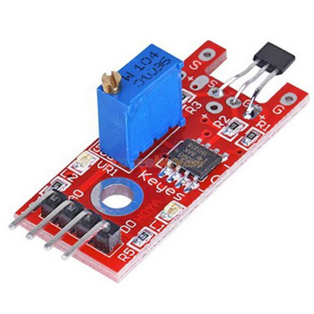
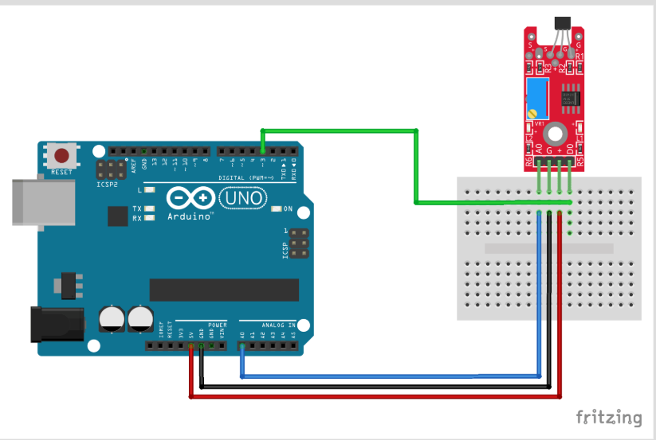
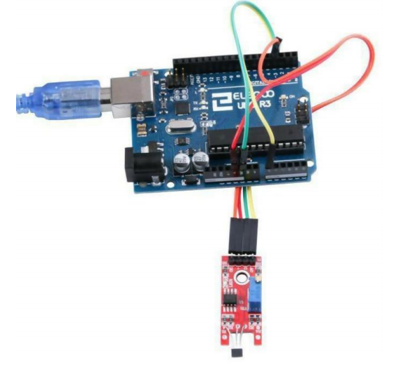
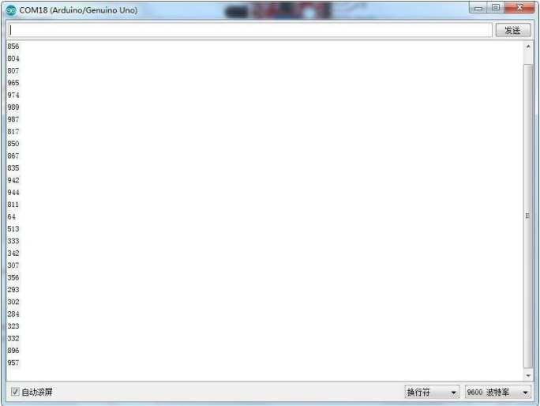

PIC | SENSOR | FUNCIÓN | URL | COLABORADOR
------------ | -------------| -------------| -------------| -------------
 | Linear Magnetic Hall Sensor | Detecta campo magenetico | [MAS INFO](https://arduinomodules.info/ky-024-linear-magnetic-hall-module/) | Erik Geovanny Osorio Lopez

# DESCRIPCIÓN 
El Módulo de Sensor Hall Magnético Lineal sirve para detectar la presencia de un campo magnético cerca
del sensor. Variables tales como la fuerza del campo, polaridad y posición de la magneto en relación al
sensor afectarán el punto en el cual la salida ‘DO’ hace el cambio al nivel alto (High). La sensibilidad del
circuito se puede ajustar con un potenciómetro.
En el pin ‘AO’ se encuentra disponible una señal analógica de salida.

## Factores de diseño – Tipos magnéticos
Unipolar: Solo un polo sur operará el sensor. El sensor enciende cuando censa un polo sur (+) y se apaga
cuando el mismo ya no está.
Bipolar: La salida del sensor depende del polo. Un polo sur (+) activa el sensor; un polo norte (-) lo
desactiva. Es posible que el sensor encienda y apague permaneciendo en un nivel Gauss positivo.
Enclavamiento: Las especificaciones son estrictas en cuanto al enclavamiento. Algunas veces se les
diseña para asegurarse que cuando un polo sur (+) se retire del sensor, el mismo permanezca enclavado
hasta ver el polo opuesto (-).
Omni polar: El sensor se diseña para operar de forma lineal Radiométrica: La salida es proporcional a la
fuerza del campo magnético. El rango de sensibilidad se la salida es de 2.5 – 3.75 mV por unidad de
Gauss

## COMPONENTES REQUERIDOS:
-1x Elegoo Uno R3
-1x Módulo de Sensor Hall Magnético Lineal 1x Cable USB
-4x Cables F-M 

## EJEMPLO DE CONCECCIÓN CON ARDUINO:
 | 

## CODIGO DE EJEMPLO Y RESULTADO:
Programa de control del puerto digital
//define el puerto del LED int Led = 13;
//define el puerto del interruptor int buttonpin = 13;
//define la variable digital val int val;
void setup()
{
//define el LED como una salida PinMode (Led, OUTPUT);
//define el interruptor como un puerto de salida
pinMode(buttonpin,INPUT);
}
void loop()
{
//Lee el valor de la interfaz digital 3 asignada a val val=digitalRead(buttonpin);
// cuando el sensor o interruptor tenga señal, el LED destellará if(val==HIGH)
{
digitalWrite(Led,HIGH);
}
else
{
digitalWrite(Led,LOW);
}
}
(2) Simulación de los procedimientos de control de boca
// Selecciona el pin de entrada para el potenciómetro int sensorPin = A0;
// Selecciona el pin para el LED int ledPin = 13;
// variable para almacenar el valor que indica el sensor int sensorValue = 0;
void setup()
{
pinMode(ledPin,OUTPUT); Serial.begin(9600);
}
void loop(){
sensorValue =analogRead(sensorPin); digitalWrite(ledPin, HIGH); delay(sensorValue);
digitalWrite(ledPin, LOW); delay(sensorValue); Serial.println(sensorValue, DEC);
}

