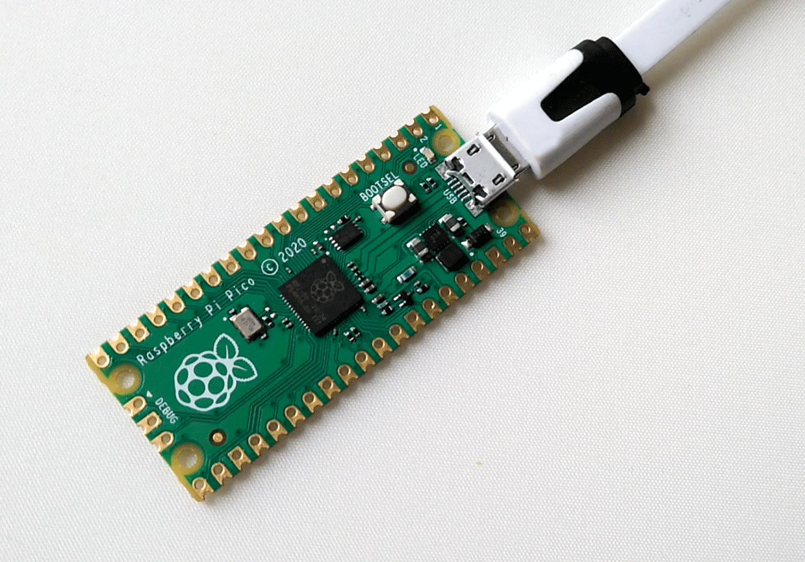

# Factory RESET Pico RP2040

Usar el archivo **flash_nuke.uf2** proporcionado para reseteo de fábrica.

---
# Instalación de Mu-Editor en Linux

Entrar con Linux en la PC de laboratorio, la clave es 123
https://codewith.mu/en/howto/1.1/install_with_python

```bash
$ apt install python3-pip
$ pip3 install mu-editor
$ pip3 install shortcut
$ shortcut mu-editor
```
---

# BLINK en CircuitPython
https://learn.adafruit.com/getting-started-with-raspberry-pi-pico-circuitpython/blinky-and-a-button

```python
"""Example for Pico. Blinks the built-in LED."""
import time
import board
import digitalio

led = digitalio.DigitalInOut(board.LED)
led.direction = digitalio.Direction.OUTPUT

while True:
    led.value = True
    time.sleep(0.5)
    led.value = False
    time.sleep(0.5)
```
---
