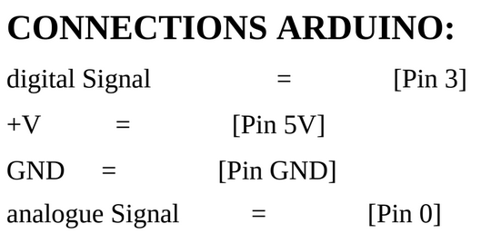
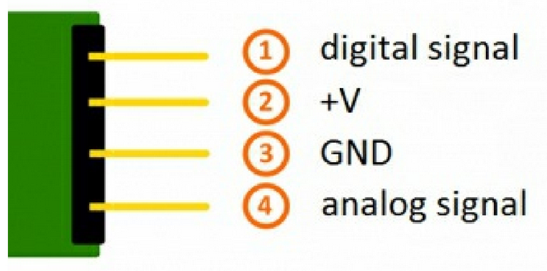

The sound detection microphone module known KY 0 38. This is a module itself. So let's get started. Today's video is brought to you by our GVS an online store where you can find shirts, jeans and gold accessories that fit your needs. All the products are made in Italy, they can be shipped worldwide, so don't waste your time start looking fancy today with their site.For more information, go to RGB SM shop dot net or check it out at the link on the video description.
This module is integrated on board one microphone one potentiometer on microchip sixers. diesters m two LED is the resistor r1 used in this module. It's Thank you arms. There is the SIR r two it's 100 kilo ohms there is the sir are three it's 150 ohms There is there are four it's one kilo there is this there are five it's one kilo and there is this there it is 100 kilo ohms. The main reason for using the resistors is to limit currents equal leading inside the module. In other words, to prevent current from burning our module, the LED l on light up to show if the module is working properly or not.

