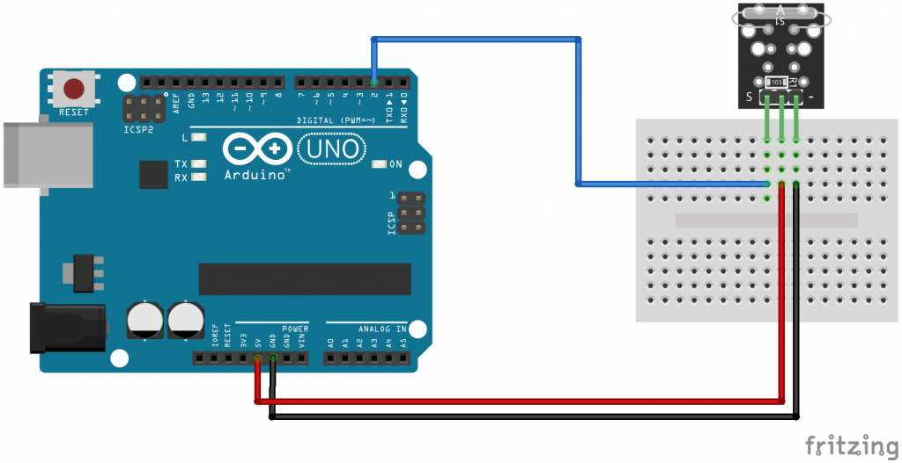

# Mini-magnetic-reed-module

El Módulo interruptor de láminas magnético Arduino Keyes KY-021. Un interruptor de lengüeta es un sensor magnético que normalmente está abierto y se cierra cuando se expone a un campo magnético.


*Especificaciones*

El mini módulo de interruptor de lengüeta magnético KY-021 consta de una resistencia de 10 kΩ y un pequeño interruptor de lengüeta accionado por un campo magnético, comúnmente utilizado en sistemas mecánicos como sensores de proximidad. Compatible con plataformas electrónicas populares como Arduino, Teensy y ESP8266.


| Tension de funcionamiento | 3.3V hasta 5V |
|---------------------------|---------------|
| Tipo de salida            | Digital       |


*Diagrama de conexión KY-021*

Conecte la línea de alimentación (medio) y la tierra (-) del módulo a +5 y GND respectivamente. Conecte la señal (S) al pin 2 en el Arduino.

| KY-021 | Arduino  |
|--------|----------|
| S      | Digital2 |
| medio  | +5V      |
| -      | GND      |


Diagrama de conexión KY-021
Código de ejemplo KY-021 Arduino

El siguiente codigo encenderá el LED del pin 13 en el Arduino cuando el módulo detecte un campo magnético,cuando este coloque un imán cerca del KY-021 para activar el interruptor del carrete.


```
int led = 13; // LED pin
int reelSwitch = 2; // magnetic senso rpin
int switchState; // variable to store reel switch value

void setup() 
{
  pinMode (led, OUTPUT);
  pinMode (reelSwitch, INPUT);
}

void loop()
{
  switchState = digitalRead(reelSwitch); // read the value of digital interface 2 and assign it to switchState
  
  if (switchState == HIGH) // when the magnetic sensor detect a signal, LED is flashing
  {
    digitalWrite(led, HIGH);
  }
  else 
  {
    digitalWrite(led, LOW);
  }
}
```


