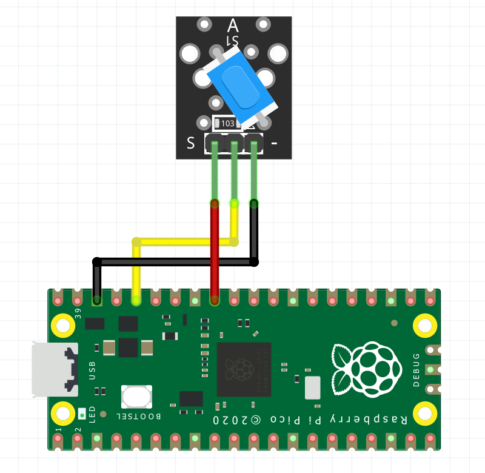

## ¿Qué es KY-020 Ball Switch?
El módulo KY-020 es un sensor de inclinación que cierra el circuito cuando está inclinado hacia un lado siempre que se mueva con suficiente fuerza y grado de inclinación para activar el interruptor de la bola en el interior. No mide el ángulo de inclinación.

## ¿Cómo funciona?
El KY-020 consiste en una resistencia de 10 kΩ y un interruptor metálico de bola con conducción bidireccional que abrirá / cerrará el circuito dependiendo de su grado de inclinación. 
Este módulo tiene 3 pines o terminales de salida, el primer pin está marcado con una “S” (Signal), el cual es el pin de salida del sensor, luego encontramos un pin que no tiene ningún símbolo pero es el VCC, donde conectaremos los 5V y por último encontramos un pin marcado con el signo menos (-), donde se conectará la tierra.

## Especificaciones y caracteristicas

| Voltaje de funcionamiento | 3.3V a 5V         |
|---------------------------|-------------------|
| Tipo de salida            | Digital           |
| Dimensiones               | 23mm x 16mm x 5mm |
| Vida Mecanica             | 100.000 ciclos    |
| Temperatura ambiente      | -25C  a 105 C     |
| Peso                      | 4g                |

## Código en MicroPython

```python
# Codigo por Rivera Perez Alex 18212259 
# Revisado por Aquino Villegas Daniel 18212144
## Error en la libreria
#Traceback (most recent call last):
#File "<stdin>", line 1, in <module>
#ImportError: no module named 'RPi'

# Al inclinar el sensor se despliega el mensaje "Sensor detectado"

from machine import Pin
import utime

pin=27
sensor=Pin(pin, Pin.IN)
utime.sleep(1)

while True:
    if sensor.value()==1:
        print("Sensor detectado")
        utime.sleep(2)    
    else:
        print("No detectado")
        utime.sleep(2)
utime.sleep(1)
```

## Diagrama

