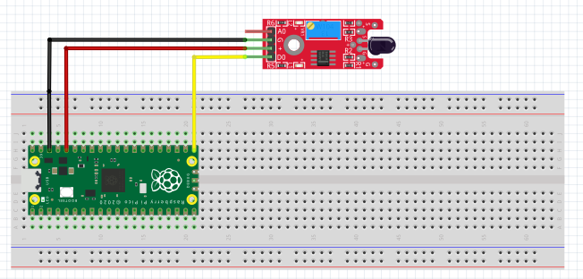

## MARCO TEÓRICO


### ¿Que és?
El Módulo KY-026 es un Sensor de Flama que por medio de un LED receptor infrarrojo detecta longitudes de onda de llama en un rango de 760nm a 1100nm. Las salidas de este sensor son digital y analógica e incluye un potenciometro para ajuste de la sensibilidad del sensor.

### ¿Cómo funciona el Sensor de Flama?
El sensor de llama KY-026 está equipado con un fotodiodo que es sensible al rango espectral de luz creado por una llama abierta. El sensor de llama detecta longitudes de onda que van desde 760 nm hasta 1100 nm en el espectro infrarrojo. Después de detectar una llama, la línea de salida digital (DO) se volverá ALTA. La salida analógica (AO) proporcionará una medición directa de la lectura.

## TABLAS TÉCNICAS

### Especificaciones y Características

| Voltaje de operación          | 3.3 a 5.5  V                                                        |
|-------------------------------|---------------------------------------------------------------------|
| Corriente de Operación        | 15 mA                                                               |
| Rango de detección            | 760 nm a 1100 nm                                                    |
| Ángulo de detección           | 60°                                                                 |
| Tipo de salida                | Digital y Analógica                                                 |
| Ajuste de sensibilidad        | Si                                                                  |
| Distancia de detección máxima | 1 metro  (puede ser mayor,  dependiendo de la magnitud de la llama) |
| Dimensiones                   | 15 mm x 36 mm                                                       |

## DIAGRAMAS



## CÓDIGO

```python
#Cuevas Oliva Josue Emanuel 18212164
#Revisado por Aquino Villegas Daniel 

from machine import Pin
import utime

flame_sensor = Pin(16, Pin.IN)
utime.sleep(2)

while True:
   if flame_sensor.value() == 1:
       print("Flame Detected")
       utime.sleep(3)
   else:
       print("No Flame")
       utime.sleep(1)
utime.sleep(0.1)
```
