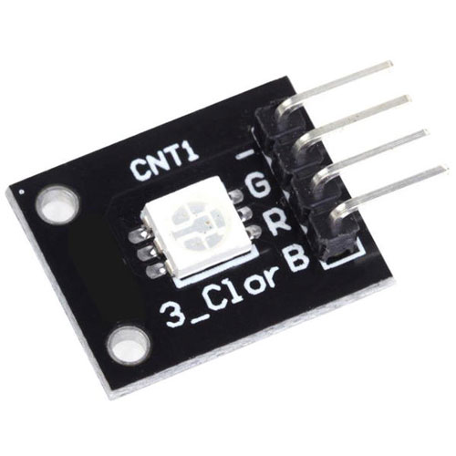
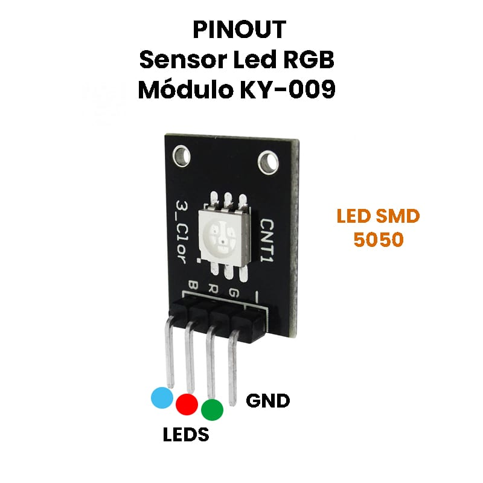

## Titulo


## Logo


___
## Introducción
El Sensor Led RGB Módulo KY-009 es un Led SMD que tiene los 3 colores primarios (Azul, Verde, Rojo) ,los cuales, con la programación adecuada permiten generar más colores. El módulo KY-009 se pueden conectar a un Arduino,ESP8266 o microcontrolador.

## ¿Para qué sirve?
Este módulo se utiliza para indicar estados, iluminar o simple decoración; ya que se puede controlar varios efectos de iluminación juntando los colores primarios.

## ¿Cómo funciona?
Para el funcionamiento del KY-009 , es recomendable usar resistencias para no dañar con el tiempo el LED,  se pueden usar resistencias de 330 Ω en cada uno de los pines de los led del KY o usar los siguientes valores sugeridos:

- Azul    (B)       120 Ω
- Verde   (G)       120 Ω
- Rojo    (R)       180 Ω
- GND

## Especificaciones
- Voltaje de Funcionamiento: 5 V
- Corriente alimentación: 30mA a 60 mA DC
- Consumo de energía: 90 mW
- Temperatura de funcionamiento: -25 °C a 80 °C
- Dimensiones: 18.5 mm x 15 mm
- Peso: 2 g
- Utiliza el 5050 SMD, LED de 3 colores con corriente máxima de 20 mA
- Voltaje de alimentación: Red (1.8 V a 2.4 V), verde (2.8 V a 3.6 V) y Azul (2.8 V a 3.6 V)

## Asignación de pines


## Diagrama


## Código
```python
#EJERCICIO:
```
