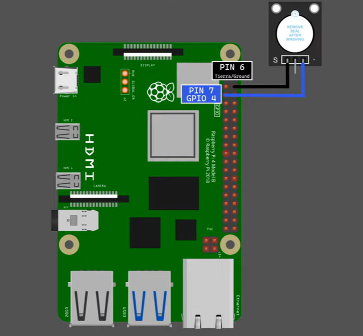

# KY-012 Buzzer    


### ¿Qué es Sensor Zumbador Activo Módulo KY-012 ?
_El Sensor Zumbador Activo KY-012 es un dispositivo electrónico que permite reproducir un sonido de un solo tono; a diferencia del KY-006 que puede reproducir diferentes tonos._

_El modulo KY-012 integra un zumbador activo, este incorpora un oscilador simple por lo que únicamente es necesario suministrar corriente al dispositivo para que emita sonido. La diferencia de un buzzer activo a un pasivo es que el pasivo necesita recibir una onda de frecuencia._

### Especificaciones y caracteristicas

| Voltaje de funcionamiento | 3.3V a 5V               |
|---------------------------|-------------------------|
| Corriente máxima          | 30 mA / 5 V             |
| Frecuencia de resonancia  | 2500 Hz ± 300 Hz        |
| Salida de sonido mínima   | 85 dB a 10 cm           |
| Temperatura de trabajo    | -20 °C a 70 °C          |
| Dimensione                | 18.5 mm, 16 mm y 10 mm  |

### Materiales para testing

  - RaspBerry pi
  - KY-012 Buzzer
  - 2x wires (Conectores)

### Conexion de pines

El sensor esta compuesto por 3 pines:
  - Tierra 
  - Sin conexion
  - Datos


Para conectarlos a la placa tenemos lo siguiente:
  - Tierra la onectamos al pin 6
  - Datos lo conectamos al pin 7



### Codigo

```python
# CESAR ANDRES TRUJILLO GARAY

import RPi.GPIO as GPIO
import time


BUZZER_PIN = 7  


def play_sound(duration, frequency):  
    for i in range(duration):
        GPIO.output(BUZZER_PIN, GPIO.HIGH)
        time.sleep(frequency)
        GPIO.output(BUZZER_PIN, GPIO.LOW)
        time.sleep(frequency)


GPIO.setmode(GPIO.BOARD)
GPIO.setup(BUZZER_PIN, GPIO.OUT)

notes = {  # Contiene las escalas de frecuencia
    'C': 0.002109, 'D': 0.001879, 'E': 0.001674, 'F': 0.001580, 'G': 0.001408,
    'A': 0.001254, 'B': 0.001117, 'C1': 0.001054,
}

for n in ['C', 'D', 'E', 'F', 'G', 'A', 'B', 'C1']:  # Play all notes
    play_sound(100, notes[n])

GPIO.cleanup()  
```

### Ejecucion

```bash
pi@raspberrypi~ python KY-012_buzzer.py
```
