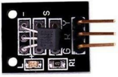
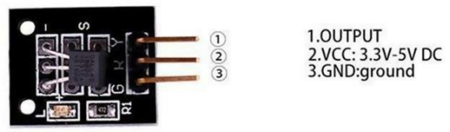

## Sensor de Temperatura DS18B20

- Es un módulo con un sensor de temperatura digital tipo ‘One Wire’ (DS18B20). Un resistor tipo pullup de 4.7K ohm se incluye para la señal del bus. Se pueden agregar sensores adicionales al bus y direccionarlos de forma individual. Solo se debe conectar un sensor tipo pullup al bus, sin importar la cantidad de sensores que se conecten al mismo.

- Rango de temperatura: -55 a +125°C
- Precisión típica: 0.5°C
- Solución: 9-12Bit, dependiendo del programación

### Marco Teórico

- El módulo DS18B20 utiliza un bus sencillo. El rango de la fuente de poder de 3.0 V a 5.5 V sin fuente de poder para tiempo de espera.

- Puede medir temperatura en un rango desde -55 grados a +125 grados, con una precisión de +/-0.5°C.

- El sensor de temperatura posee un DPI programable puede ajustarse entre 9 y 12. La - temperatura propiamente dicha se representa mediante 12 bits y puede registrarse a una tasa máxima de una vez cada 750 milisegundos.

- Cada DS18B20 contiene un número de serie único, de forma que puede haber múltiples chips DS18B20 en un bus.

- Este modulo tiene 3 pines los cuales son Output, VCC, GND, representados en la siguiente imagen

