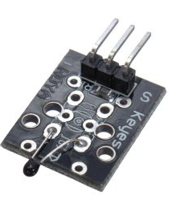
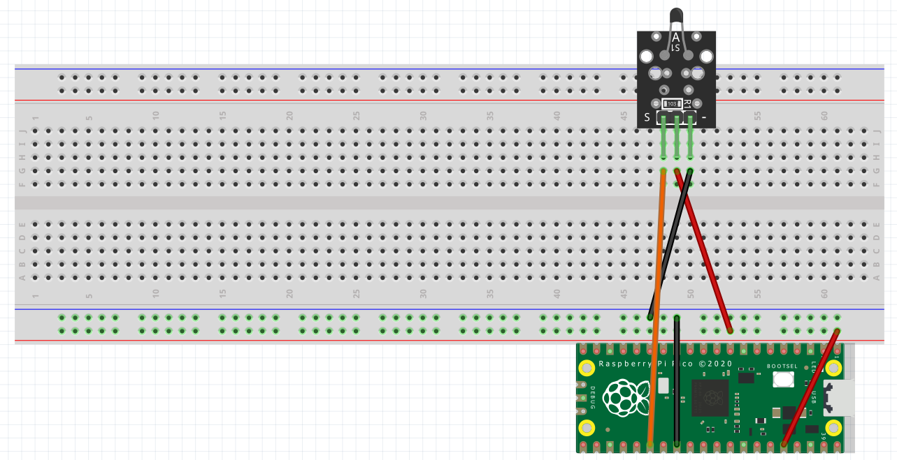

## Sensor de Temperatura analogo

-El componente MF52-103 es un sensor análogo de temperatura que normalmente es utilizado en equipos de aire acondicionado, equipos de calefacción, equipos médicos, instrumentación de control de temperatura, higrómetro electrónico, calendario electrónico de temperatura de la automoción, la batería recargable y cargador, batería del ordenador portátil


|Especificaciones|
|:----|
|Modelo: MF52-103|
|Material aislante: Ceramica|
|Color: Negor|
|Potencia nominal: 0.05W|
|Valor de resistencia: 10k|
|Tolerancia de resistencia: H (±3%)|
|Valor B: 3950K|



- El esquema de conexión de este sensor es el siguiente:


### Diagrama de conexión

El siguiente diagrama de conexión es de un thermistor el cual necesita una resistencia de valor de 10k ohms
Los correspondientes pines en la Pi Pico son:
- Pin # 28 Tierra
- Pin # 40 VSUS (5.0 V)
- Pin # 26 para la lectura analoga



# Código

```python
# Avila Jimenez David Alfredo
# Código perfeccionado por Alvarez Espinoza y Avila Jimenez

import machine
from utime import sleep
from math import log

def main():
    sensor_temperatura = machine.ADC(26)
    c1 = 0.001129148
    c2 = 0.000234125
    c3 = 0.0000000876741
    R1 = 10000.0

    while True:
        R2 = R1 / (65535 / (float(sensor_temperatura.read_u16()) - 1))
        logR2 = log(R2)
        temperatura = (1.0 / (c1 + c2*logR2 + c3*logR2*logR2*logR2))-281.10
        print('Temperatura: ' + str(temperatura) + ' °C')
        sleep(2)

if __name__ == '__main__':
    main()
