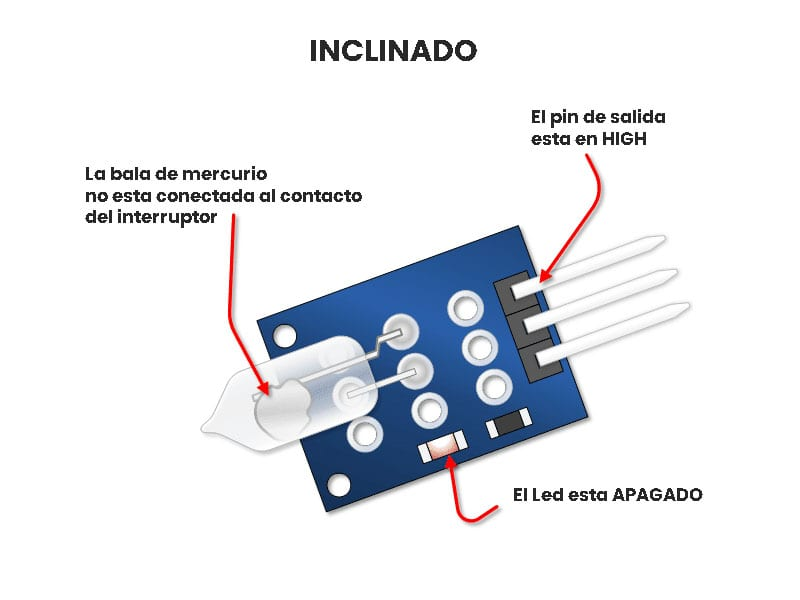

## Titulo

## Logo

___
## Introducción
El Sensor Interruptor Mercurio Módulo KY-017 es un módulo que te permitirá detectar la inclinación de un objeto para que puedas generar una acción de control, es una buena alternativa de bajo costo para remplazar un acelerómetro de 6 ejes.

## ¿Para qué sirve?
El KY-017 es el precursor de los ahora llamados acelerómetros utilizados en los dispositivos móviles como celulares inteligentes y tabletas. Cuando se ajusta o situada estratégicamente, puede ser muy sensible. Son útiles para nivelar sistemas.

## ¿Cómo funciona?
Este modulo consta de una resistencia de 680Ω y un LED que se enciende y se apaga cuando se detecta una inclinación, internamente el modulo cuenta con mercurio que cierra el circuito cuando se inclina el módulo. La clave para usar con éxito este interruptor está en la comprensión de los dos estados de funcionamiento:

#### Posición no Inclinado: 
No inclinado significa que los contactos del interruptor se interconectan por la bola de mercurio. En este estado, la salida será baja y el LED se encenderá.

#### Posición Inclinada: 
Significa que la bola de mercurio no está conectada a los contactos del interruptor. En este estado, el LED está apagado, y la salida es ALTA.

## Especificaciones
- Voltaje de funcionamiento: 3.3 Volts  a 5 Volts
- Interruptor digital salida:  0 y 1
- Dimensiones: 26 mm x 15 mm x 9 mm
- Bajo consumo de energía
- Peso: 2 g

**NOTA:** El dispositivo contiene mercurio. Se recomienda un adecuado tratamiento para evitar romper la cobertura de vidrio y que el mercurio escape, ya que este elemento es contaminante y tóxico.

Para poder conectar el sensor al microcontrolador se necesita tomar en cuenta la siguiente tabla para **conectar una resistencia en el pin del LED**.
| Voltaje | Resistencia |
|---------|-------------|
| 3.3v    | 120 ohms    |
| 5v      | 220 ohms    |

## Asignación de pines

## Diagrama

## Código
