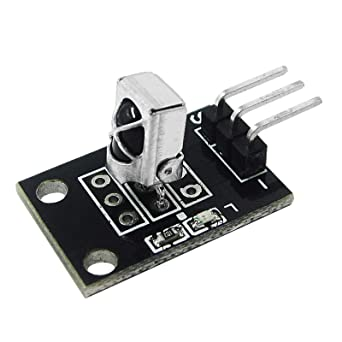
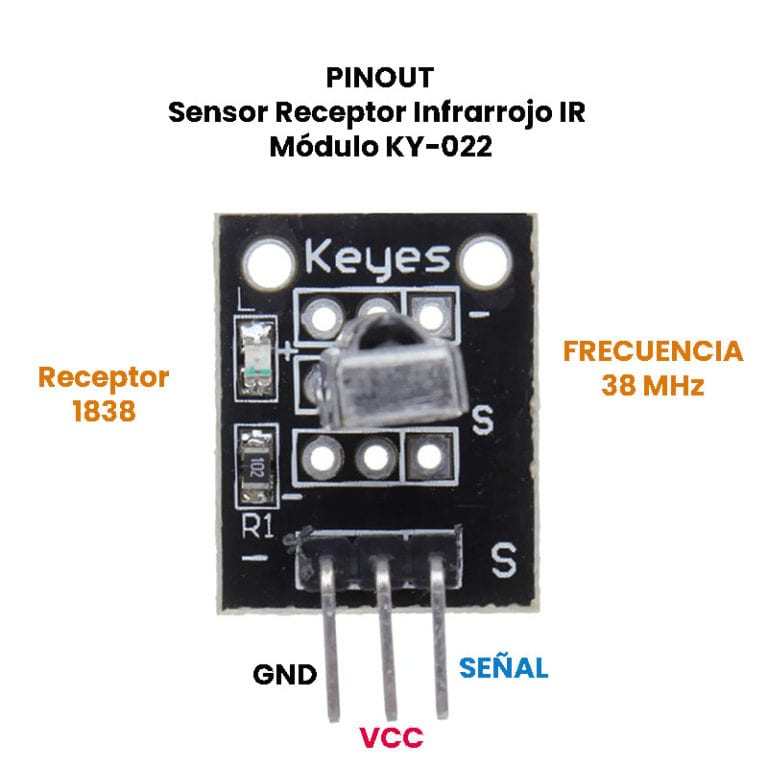
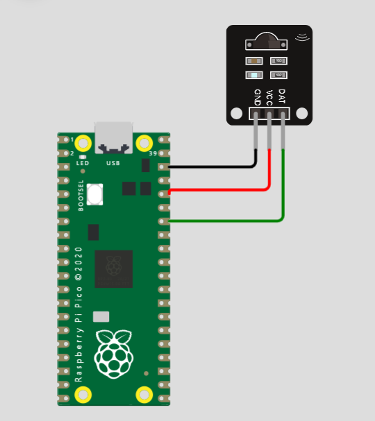

## ¿Qué es Sensor Receptor Infrarrojo IR?
El Sensor Receptor Infrarrojo IR es un módulo KY-022 que esta construido de un receptor IR TL1838, el cual reacciona a la luz infrarroja de 38 KHz y funciona en conjunto con el emisor KY-005.



## ¿Para que sirve?
Esté modulo KY-022 se utilizan en muchos equipos domésticos, para controles remoto universales, utiliza la codificación NEC, y funciona muy bien principalmente en vehículos con MP3, marco de fotos digital, iluminación equipada.

## ¿Como funciona?
El funcionamiento de un detector infrarrojo se basa en que los rayos infrarrojos pasan al interior del fototransistor donde se encuentra un material piroeléctrico, que es el que reacciona a la presencia de los rayos infrarrojos.



## Especificaciones tecnicas 

| Voltaje de funcionamiento     | 2.7 V a 5 V                         |
|-------------------------------|-------------------------------------|
|Corriente de funcionamiento    | 0.4 mA a 1.5 mA                     |
|Distancia de recepción         | 18 m                                |
|Ángulo de recepción            | ± 45º                               |
|Frecuencia portadora           | 38 KHz                              |
|Voltaje de bajo nivel          | 0.4 Volts                           |
|Voltaje de alto nivel          | 4.5 Volts                           | 
|Filtro de luz ambiente hasta   | > 500 LUX                           |
|Dimensiones                    | 15 x 18.5 x 10 mm                   | 
| Peso                          | 3gr                                 |

## Diagrama





## Codigo
```python
#
# Por: ANA KAREN MARTINEZ ESTRADA

#Revisado por: Daniel Garcia - 18212185
#NOTA: Me dice que el modulo ir_rx no existe. Probablemente es por culpa de la libreria. Tendras la libreria que me puedas pasar?
#

import time
from machine import Pin
from ir_rx import NEC_16

def callback(data, addr, ctrl):
    if data > 0:  # NEC protocol sends repeat codes.
        print('Data {:02x} Addr {:04x}'.format(data, addr))

ir = NEC_16(Pin(28, Pin.IN), callback)
```
