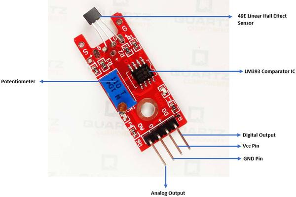

## Titulo


## Logo


___
## Introducción
El módulo KY-024 Sensor de Campo Magnético Lineal se activa cuando detecta un campo magnético proveniente de un imán natural o de algún material ferromagnético, sus principales partes son un potenciometro para ajustar la sensibilidad y un sensor de Efecto Hall Lineal . Así mismo en su salida los da como resultado señales analógicas y digitales.

El sensor de campo magnético se compone de un circuito integrado 49E, comparador voltaje LM393, dos leds, seis resistencias y un header macho de ángulo de 4 pines.

## ¿Para qué sirve?
Una aplicación típica del Sensor de Campo Magnético KY-024 es que se puede utilizar para el realizar el cálculo de la velocidad de un mecanismo en rotación o como un interruptor de proximidad. También hay sensores de tipo interruptor, que están limitados a solo intervenir para alcanzar un umbral de intensidad (ver KY003) y, por lo tanto, proporcionan solo un estado de encendido / apagado de salida.

## ¿Cómo funciona?
El módulo KY-024, la intensidad del punto 0 debería corresponder aproximadamente a 2.5 Volts con una excursión a 0 Volts y + 5 Volts en el paso 1024 Si se alimenta con precisión a 5 Volts. A pesar de que este sensor tiene una respuesta lineal, sin embargo, no es adecuado para ser utilizado como una medida de la intensidad de un campo magnético debido a la baja precisión.

#### ¿Que es el Efecto Hall?
Esté fenómeno fue descubierto por Edwin Hall en 1879, el noto que cuando un flujo de electrones circula a través de un conductor y es expuesta a un campo magnético, produce un voltaje saliente proporcional al producto de la magnitud de la fuerza del campo magnético y del flujo de electrones.

## Especificaciones
- Voltaje de alimentación: 3.3 a 5 V
- Comparador de salida de corriente: 16 mA
- Tipo de Salida: Digital y Analógica
- Temperatura de operación:  – 40 °C a 85 °C
- Dimensiones: 40mm x 26mm x 32 mm
- Peso: 4 g

## Asignación de pines


## Diagrama


## Código
```python
#EJERCICIO:
```

