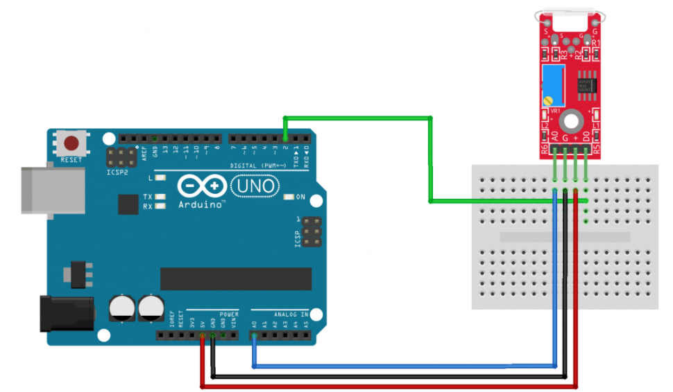

# KY-025 Reed Switch

### ¿Qué es Sensor KY-025 Reed Switch?

_El KY-025 Reed Switch Module es un pequeño interruptor eléctrico operado por un campo magnético aplicado, comúnmente utilizado como sensor de proximidad._
_El módulo tiene salidas digitales y analógicas._
_Se utiliza un recortador para calibrar la sensibilidad del sensor._
_Compatible con Arduino, Raspberry Pi, ESP32 y otros microcontroladores._

### Especificaciones

| Voltaje de funcionamiento       | 3.3V a 5.5V             |
|---------------------------------|-------------------------|
| Dimensiones                     | 1.5cm x 3.6cm           |
| Salidas                         | Analógica y digital     |
|Sensor magnético                 | Alta sensibilidad       |
|Comparador de salida de corriente| 16 mA                   |
|Peso                             | 3 g                     |

## Material para testing

  - Tarjeta arduino 
  - KY-025 Reed Swtich
  - 4 wires(Conectores)

## Conexion de pines

