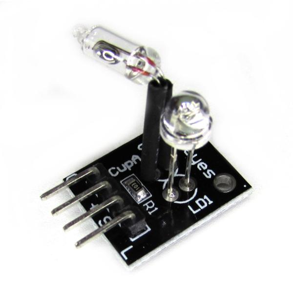

___
## Introducción
El Modulo KY-027 Sensor Magic Cup Light es un sensor que detecta vibraciones o inclinaciones en una superficie por medio de un interruptor de mercurio, entregando una salida digital que activa el regulador PWM y posee un LED que enciende cuando detecta dicha inclinación.

## ¿Para qué sirve?
El Modulo KY-027 Sensor Magic Cup Light son fáciles de desarrollar, los ejemplos mas destacados es para proyectos de nivelación o control de estabilidad; como robot, carros, drones, etc. Este módulo es compatible con Arduino, ESP8266, Raspberry o con cualquier Microcontrolador que posea un pin de 5V.

## ¿Cómo funciona?
Su funcionamiento es como el de un interruptor, ya que tiene dos posiciones de salida: 0 y 1. Está formado por una pequeña cápsula transparente que contiene una bola de mercurio en contacto con dos alambres, que permiten hacer contacto.

## Especificaciones
- Voltaje de alimentación: 3.3 a 5 V
- Tipo de Salida: Digital
- Corriente de salida: 12 mA
- Dimensiones: 20mm x 18mm x 15 mm

**NOTA:** El dispositivo contiene mercurio el cual es altamente toxico, uso delicado.

## Asignación de pines

## Diagrama

## Código
