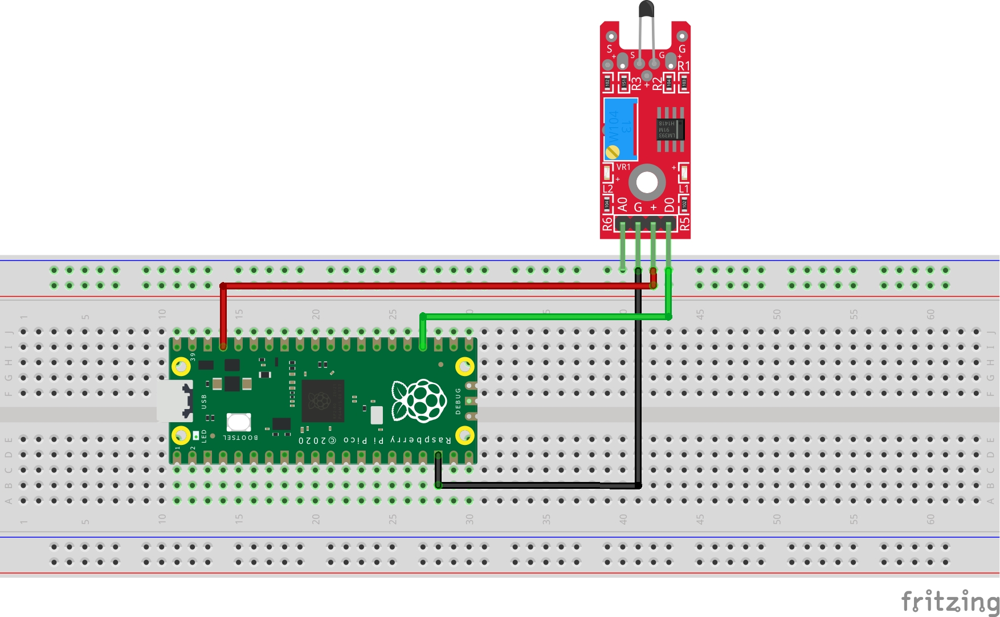

# Sobre Raspberry Pi Pico
La Raspberry Pi Pico es una placa con microcontrolador creada por la fundación Raspberry Pi. Está diseñada para ser de bajo coste y al mismo tiempo incluir un conjunto razonable de entradas y salidas para el procesador RP2040. Además del procesador incluye 2 MB de memoria Flash y un chip para gestión de la alimentación que admite tensiones de entrada de 1,8 a 5,5 V.

La Rapsberry Pi Pico se caracteriza por las diversas aplicaciones en las que se pueda usar y por su accesible precio, teniendo en cuenta las características que nos ofrece, permitiéndonos así, hacer uso de ella en diversos proyectos escolares o personales.


# Sensores
Un sensor es un dispositivo que está capacitado para detectar acciones o estímulos externos y responder en consecuencia. Estos aparatos pueden transformar las magnitudes físicas o químicas en magnitudes eléctricas.


# Sensor KY-028 Digital Temperature

## ¿Qué es?
El Modulo KY-028 Sensor Temperatura Digital nos permite medir la temperatura a través de un termistor  NTC, en el cual el proceso de acondicionamiento de los datos le permitirá al sensor adecuar una señal de trabajo operable. Esta construido de un termistor NTC, un comparador LM393, dos led indicadores, un potenciometro.

## Funcionamiento
Se puede utilizar el Modulo KY-028 Sensor Temperatura Digital para medir la temperatura ambiente, para la activación o desactivación de un sistema de un proceso, el monitoreo y el control de temperatura.

El sensor temperatura (KY-028) tiene 3 componentes principales en su placa de circuito. Primero, la unidad del sensor en la parte frontal del módulo que mide el área físicamente y envía una señal analógica a la segunda unidad, el amplificador. La señal será amplificada y de acuerdo con el valor ajustado del potenciómetro, y enviará la señal a la salida analógica del módulo.
El tercer componente es un comparador que apaga la salida digital y el LED si la señal cae por debajo de un valor específico.

Por lo tanto las salidas tienen como función:
- Salida Digital: al medir una temperatura que es más alta que el valor límite, se mostrará aquí; puede establecer el valor límite mediante un potenciómetro
- Salida Analógica: medición directa de la unidad de sensor

## Ficha técnica 
|            Característica              |         Valor       |
|----------------------------------------|---------------------|
| Voltaje de funcionamiento              | 3.3V a  5V          |
| Rango de medición de temperatura       | -55 °C / + 125 °C   |
| Dimensiones                            | 38 x 15 x 14 mm     |
| Peso                                   | 3g                  |

  
# Descripción del trabajo

## ¿Qué se busca hacer?
Determinar la temperatura del ambiente gracias al sensor KY-028 Digital temperature, permitiendo imprimir un mensaje mostrando la temperatura actual.
Todo esto usando una Raspberry Pi Pico, el cual ya cuenta con entradas análogas, permitiendo que sea más sencillo elaborar un circuito, pues no se necesita ningún convertir de Análogo a Digital. 

## Diagrama



## Código
````python
from machine import Pin
import utime
 
sensor_temp = machine.ADC(4)
conversion_factor = 3.3 / (65535)
 
while True:
    reading = sensor_temp.read_u16() * conversion_factor 
    temperature = 27 - (reading - 0.706)/0.001721
    print(temperature)
    utime.sleep(2)
````
