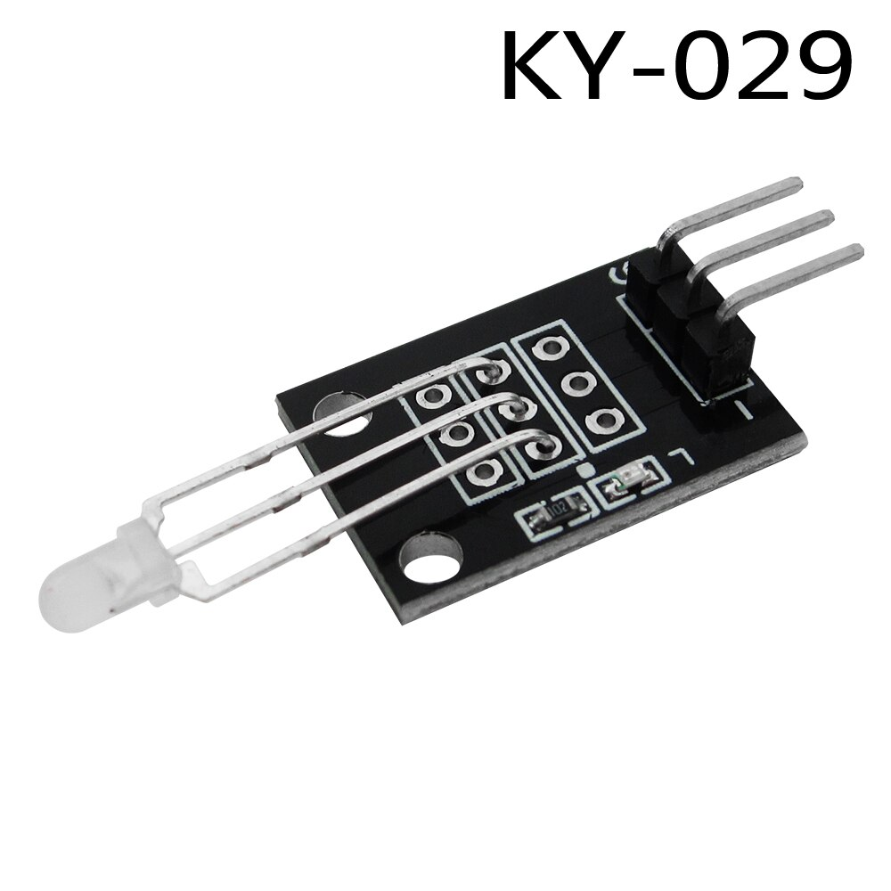
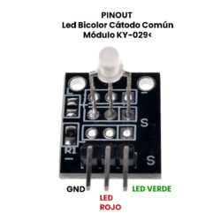
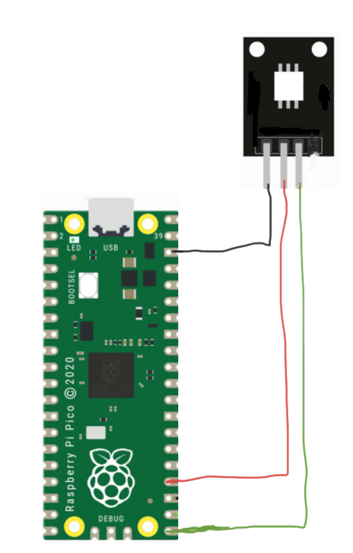

## Titulo


## Logo


___
## Introducción
El módulo Led Bicolor KY-029 es diodo cátodo común difuso con la capacidad de emitir luz verde o roja, este ajuste puedes realizarlo por medio de PWM. Es recomendable usar en los pines de los leds resistencias de 330 o 220 ohm, para evitar el pronto deterioro.

## ¿Para qué sirve?
El KY-029 Led Bicolor son ampliamente utilizados en diccionario electrónico, PDA, MP3, auriculares, cámaras digitales, VCD, DVD, audio para el automóvil, comunicaciones, computadoras, cargadores, amplificadores de potencia, instrumentación, regalos, juguetes electrónicos, teléfonos móviles, y muchos otros campos. En otros términos, se utilizan como indicadores luminosos, qué los pueden indicar la activación o desactivación de algún dispositivo electrónico.

## ¿Cómo funciona?
Para que tenga una larga vida útil el modulo, se recomienda utilizar resistencias eléctricas a las salidas del pin (Red,Green) respectivamente. Para iniciar con la prueba es necesario utilizar el multímetro en el modo de continuidad, con las puntas del mismo tendrás que realizar lo siguiente. La punta roja en el pin (Red) y la punta negra a negativo del modulo. utiliza la misma técnica para el pin (Green).

Nota: Recuerda realizar la prueba sin tener alimentado el modulo.

¿Qué es un LED bicolor?
Es un diodo emisor de luz, qué tiene la peculiaridad de mostrarnos dos fuentes de luz distintas. internamente esta construida por un material semiconductor.

## Especificaciones
- Voltaje de alimentación:
- Verde: (2.3 – 2.6 Volts)
- Rojo: (1.9 –  2.2 Volts)
- Consumo de corriente: 20 mA
- Tipo de Salida: Digital
- Tipo de diodo: Difusión
- Color:  Verde + Rojo
- Longitud de onda: 571nm a 625 nm
- Diámetro: 3 mm
- La intensidad luminosa (MCD): 20 – 40; 60 – 80
- Dimensiones: 30mm x 15mm x 13 mm
- Peso: 1.5 g

**NOTA:** Requiere resistencias de 330 o e 220 ohm.

## Asignación de pines


## Diagrama


## Código
```python
# Codigo hecho y verificado por Alvarez Espinoza Raul - 18212141

from machine import Pin
import time

'''
Don't forget the resistors for the leds
'''

red = Pin(18, Pin.OUT)
green = Pin(19, Pin.OUT)

while True:
    red.value(1)
    green.value(0)
    time.sleep(1)
    
    red.value(0)
    green.value(1)
    time.sleep(1)
    
    red.value(1)
    green.value(1)
    time.sleep(1)
    
    red.value(0)
    green.value(0)
    time.sleep(1)
```

## Conclusion
Buen modulo de led para probar que puede ser util puesto que es un led que maneja dos colores.

