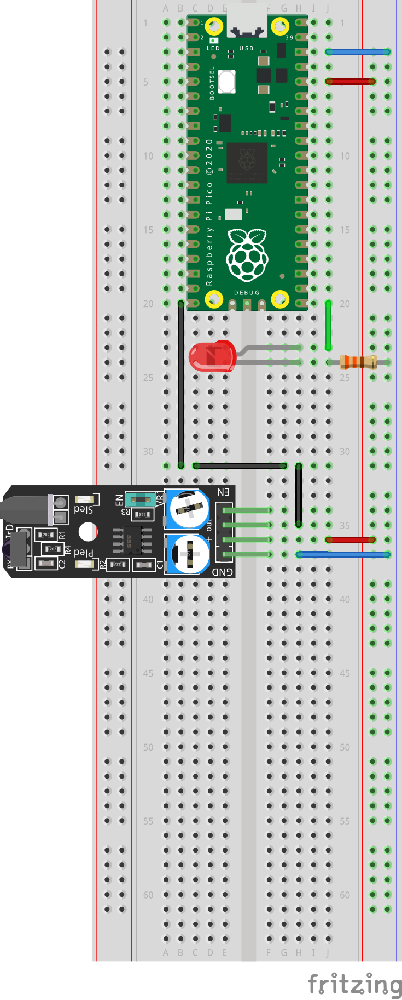
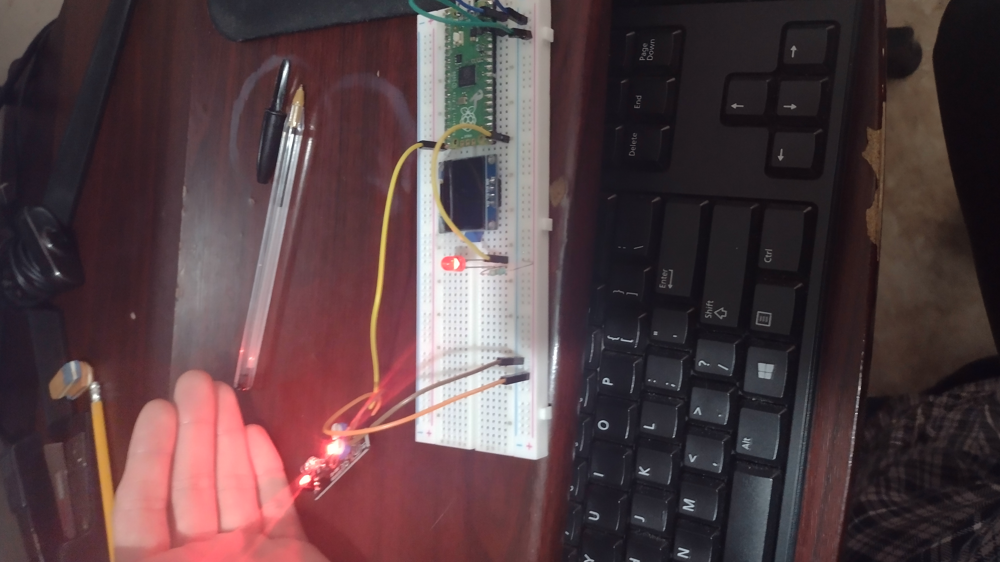
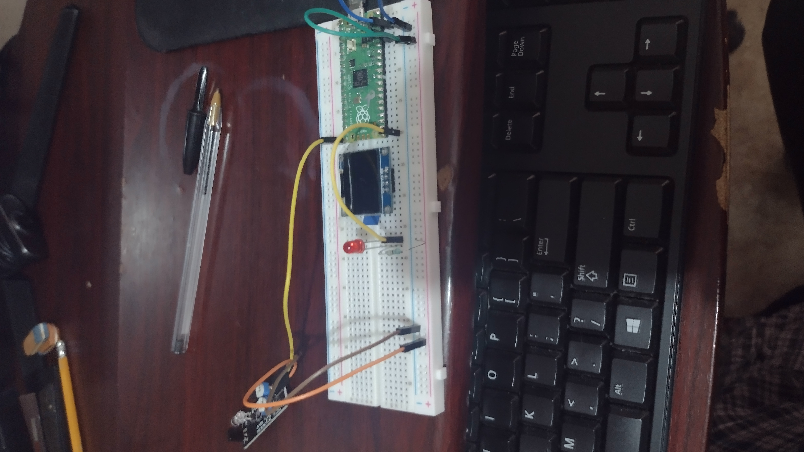

## Raspberry Pi Pico
<div style="text-align: justify"> La Raspberry Pi Pico es una tarjeta de desarrollo basada en el microcontrolador RP2040. Esta tarjeta ha sido diseñada para ser una plataforma de desarrollo muy flexible y de bajo costo. El RP2040 es un chip diseñado por Raspberry Pi que cuenta con dos núcleos ARM Cortex-M0+ que trabajan a 133 MHz, memoria Flash de 2 MB y con memoria RAM de 264 KB. La Raspberry Pi Pico tiene integrada una fuente de alimentación conmutada (SMPS, Switch Mode Power Supply) buck-boost que permite generar lo 3.3 V requeridos para alimentar al RP2040 a partir de un amplio rango de voltajes de entrada (de ~1.8 a 5.5 V). </div>


## Sensores
<div style="text-align: justify"> Un sensor es un dispositivo que detecta el cambio en el entorno y responde a alguna salida en el otro sistema. Un sensor convierte un fenómeno físico en un voltaje analógico medible (o, a veces, una señal digital) convertido en una pantalla legible para humanos o transmitida para lectura o procesamiento adicional.</div>

<div style="text-align: justify"> Uno de los sensores más conocidos es el micrófono, que convierte la energía del sonido en una señal eléctrica que puede amplificarse, transmitirse, grabarse y reproducirse.</div>

## Sensor de obstaculos
<div style="text-align: justify"> El Sensor de Obstáculos  KY-032 es un módulo capaz de detectar obstrucciones  por medio de un transmisor y receptor; que trabajando en conjunto captan la luz y realizando una diferencia de luz detectan el obstáculo en un rango entre 2 a 40 cm. </div>


### ¿Para qué sirve?

<div style="text-align: justify"> El Sensor de Obstáculos KY-032 es útil para detectar obstáculos en proyectos como seguidores de línea, robot minisumos; es compatible con Arduino y microcontroladores que los proporcione una alimentación de 5 volts. </div>


### Especificación y Características

- Voltaje de Trabajo: 3.3 V a 5 V
- Corriente:  ≥ 20 mA
- Distancia de Detección:  2  a 40 cm
- Temperatura de Operación :  -10 ℃   a  50 ℃
- Dimensiones: 41mm x 18mm x 13 mm
- Peso: 6 g 

## Diagrama



### Conexiones

|   Raspberry Pi Pico  | Sensor (KY-032) |
|:--------------------:|:---------------:|
|           -          |   EN (Enable)   |
|       3V3(OUT)       |      + (+V)     |
|          GND         |       GND       |
| GP15/SPI1_TX/I2C_SCL |   OUT (Signal)  |

### Código

El programa lee el estado actual del pin del sensor y emite en la consola en serie si el detector de obstáculos se encuentra actualmente frente a un obstáculo o no.

````python
#
# Por: JESUS ANTONIO ARELLANO HERNANDEZ
#


# Se importan los pines y utime.
from machine import Pin
import utime

# Conectamos los pines del Raspberry al sensor y al led. Y los configuramos
led = Pin(16, Pin.OUT)
sensor = Pin(15, Pin.IN)

# Con este loop estaremos detectando si hay un obstaculo o no
while True:

# Con estás lineas imprimimos el valor del sensor (0 o 1)
	print(sensor.value())
	utime.sleep_ms(20)
	
# Con el if decidimos si se prende el led o no, segun el valor del sensor
	if sensor.value() == 1:
		led.value(0)
	else:
		led.value(1)
````

## Evidencias

Se muestran imágenes del funcionamiento del circuito.




