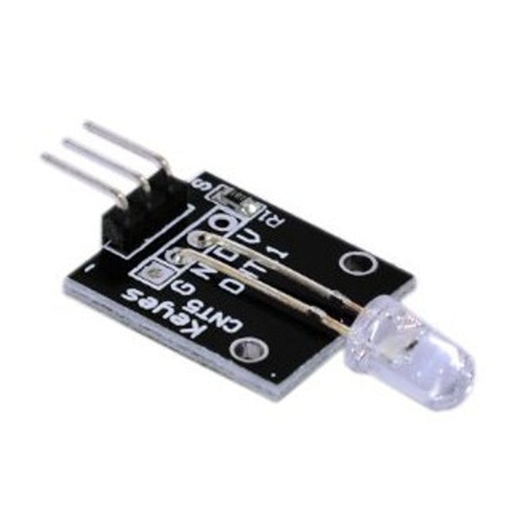

### El módulo KY-034 Led Flash te permitirá generar una luz aleatoria muy intensa y de 7 colores de forma fácil y rápida

## MARCO TEÓRICO

### Descripción
El Led Flash de 7 colores es útil para sistemas en donde se requiera algún tipo de señalización visual o decorativo, por ejemplo en maquinaria, juguetes, sistemas de control, por mencionar algunos.

Este módulo de color cambiante está compuesto por un led emisor de luz de alto brillo y una resistencia limitadora de superficie para proteger el led. Dicho led es de 5 mm redondo con modelo del producto YB-3120B4PnYG-PM que posee una lente tipo “luz antiniebla blanco” y maneja un voltaje estándar de 3.0 – 4.5 volts, pero debido a la resistencia limitadora incluida funcionara perfectamente a 5 Volts.
