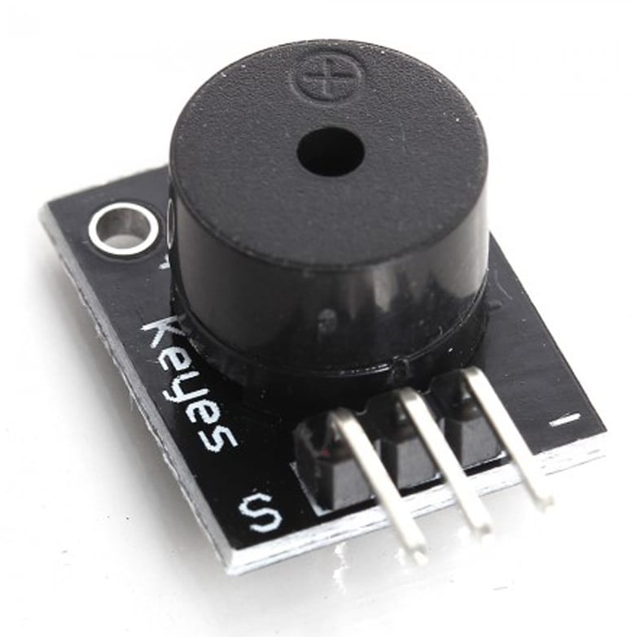
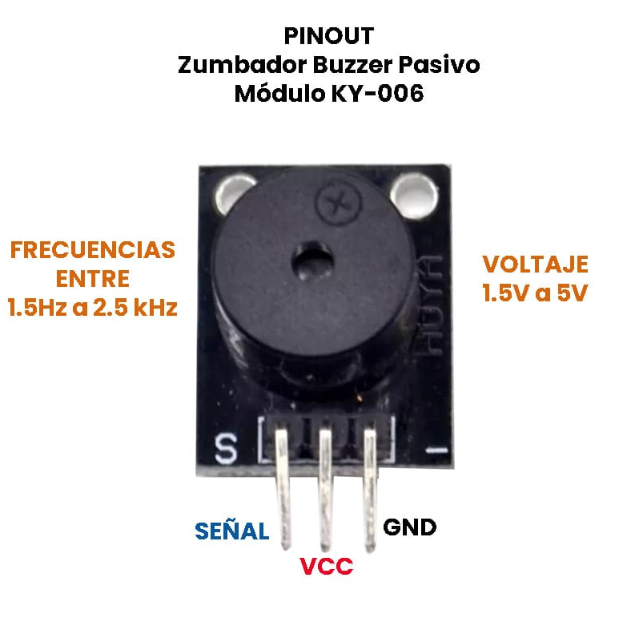

### Módulo de zumbador piezoeléctrico pasivo Arduino KY-006, puede producir una gama de tonos de sonido dependiendo de la frecuencia de entrada.

## MARCO TEÓRICO

### Descripción
El Zumbador Buzzer Pasivo Módulo KY-006 es un sensor piezoeléctrico el cual puede reproducir tonos de sonido entre un rango de 1.5Hz a 2.5 kHz dependiendo de la frecuencia de entrada, ya sea mediante retardos o modulación de ancho de pulso (PWM).  Como este Buzzer pasivo no tiene un oscilador interno, necesita que se indique por medio de un microcontrolador la frecuencia deseada.

### Diferencia entre buzzer pasivo y buzzer activo
Un buzzer pasivo no dispone de electrónica interna, por lo que tenemos que proporcionar una señal eléctrica para conseguir el sonido deseado. En oposición, un buzzer activo dispone de un oscilador interno, por lo que únicamente tenemos que alimentar el dispositivo para que se produzca el sonido. En resumen, un buzzer pasivo puede producir sonido a diferentes frecuencias mientras que el buzzer activo suena en una frecuencia fija.

## TABLAS TÉCNICAS

### Especificaciones
* Voltaje de Funcionamiento: 1.5V a 5V DC
* Rango de generación de tonos: 1.5 Hz– 2.5 kHz
* Dimensiones: 18mm x 15mm
* Corriente de trabajo: < 25mA
* Pines: GND, VCC y Señal

