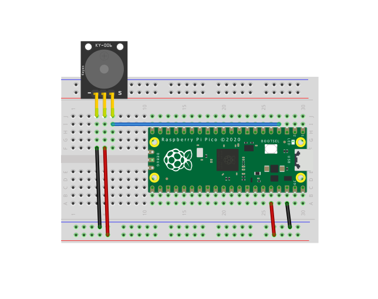

### Módulo de zumbador piezoeléctrico pasivo Arduino KY-006, puede producir una gama de tonos de sonido dependiendo de la frecuencia de entrada.


## MARCO TEÓRICO

### Descripción
El Zumbador Buzzer Pasivo Módulo KY-006 es un sensor piezoeléctrico el cual puede reproducir tonos de sonido entre un rango de 1.5Hz a 2.5 kHz dependiendo de la frecuencia de entrada, ya sea mediante retardos o modulación de ancho de pulso (PWM).  Como este Buzzer pasivo no tiene un oscilador interno, necesita que se indique por medio de un microcontrolador la frecuencia deseada.


### Diferencia entre buzzer pasivo y buzzer activo
Un buzzer pasivo no dispone de electrónica interna, por lo que tenemos que proporcionar una señal eléctrica para conseguir el sonido deseado. En oposición, un buzzer activo dispone de un oscilador interno, por lo que únicamente tenemos que alimentar el dispositivo para que se produzca el sonido. En resumen, un buzzer pasivo puede producir sonido a diferentes frecuencias mientras que el buzzer activo suena en una frecuencia fija.


## DIAGRAMAS

* GND -----> Pin 38
* VCC ------> Pin 36
*  SEÑAL---> Pin 4

***Nota: Parece ser que el componente del KY-006 en fritzing tiene los pines diferentes al Pinout que se muestra más abajo (tiene el pin de GND invertido con el de Señal). Verificar los pines del KY-006 que se encuentra en la caja y realizar las conexiones en base a la lista de arriba.***




## TABLAS TÉCNICAS

### Especificaciones
* Voltaje de Funcionamiento: 1.5V a 5V DC
* Rango de generación de tonos: 1.5 Hz– 2.5 kHz
* Dimensiones: 18mm x 15mm
* Corriente de trabajo: < 25mA
* Pines: GND, VCC y Señal


## CÓDIGO

```python
#Reproducir una canción con passive buzzer en Raspberry Pi Pico
#Chavez Duarte Fernando 18212160

from machine import Pin, PWM
from utime import sleep
buzzer = PWM(Pin(2))

tones = {
"B0": 31,
"C1": 33,
"CS1": 35,
"D1": 37,
"DS1": 39,
"E1": 41,
"F1": 44,
"FS1": 46,
"G1": 49,
"GS1": 52,
"A1": 55,
"AS1": 58,
"B1": 62,
"C2": 65,
"CS2": 69,
"D2": 73,
"DS2": 78,
"E2": 82,
"F2": 87,
"FS2": 93,
"G2": 98,
"GS2": 104,
"A2": 110,
"AS2": 117,
"B2": 123,
"C3": 131,
"CS3": 139,
"D3": 147,
"DS3": 156,
"E3": 165,
"F3": 175,
"FS3": 185,
"G3": 196,
"GS3": 208,
"A3": 220,
"AS3": 233,
"B3": 247,
"C4": 262,
"CS4": 277,
"D4": 294,
"DS4": 311,
"E4": 330,
"F4": 349,
"FS4": 370,
"G4": 392,
"GS4": 415,
"A4": 440,
"AS4": 466,
"B4": 494,
"C5": 523,
"CS5": 554,
"D5": 587,
"DS5": 622,
"E5": 659,
"F5": 698,
"FS5": 740,
"G5": 784,
"GS5": 831,
"A5": 880,
"AS5": 932,
"B5": 988,
"C6": 1047,
"CS6": 1109,
"D6": 1175,
"DS6": 1245,
"E6": 1319,
"F6": 1397,
"FS6": 1480,
"G6": 1568,
"GS6": 1661,
"A6": 1760,
"AS6": 1865,
"B6": 1976,
"C7": 2093,
"CS7": 2217,
"D7": 2349,
"DS7": 2489,
"E7": 2637,
"F7": 2794,
"FS7": 2960,
"G7": 3136,
"GS7": 3322,
"A7": 3520,
"AS7": 3729,
"B7": 3951,
"C8": 4186,
"CS8": 4435,
"D8": 4699,
"DS8": 4978
}

song = ["E5","G5","A5","P","E5","G5","B5","A5","P","E5","G5","A5","P","G5","E5"]

def playtone(frequency):
    buzzer.duty_u16(1000)
    buzzer.freq(frequency)


def bequiet():
    buzzer.duty_u16(0)


def playsong(mysong):
    for i in range(len(mysong)):
        if (mysong[i] == "P"):
            bequiet()
        else:
            playtone(tones[mysong[i]])
        sleep(0.3)
    bequiet()


playsong(song)
