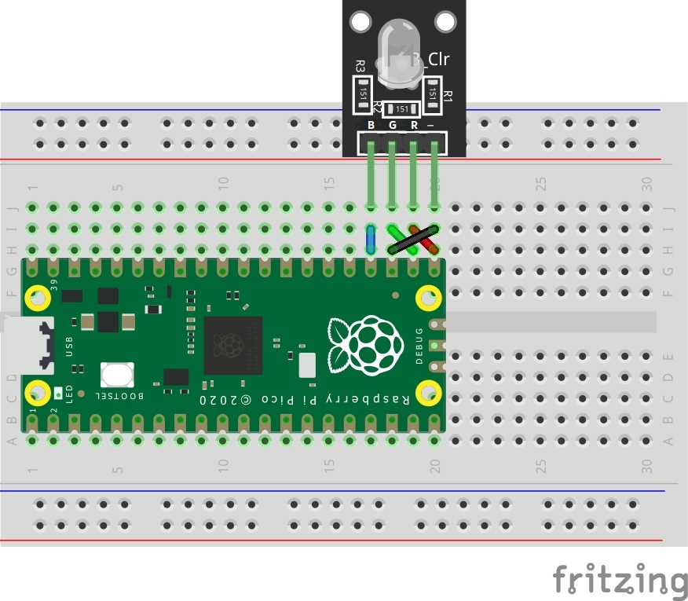
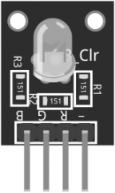

### KY-016 RGB LED


# Marco teórico
### ¿Qué es el Sensor Led RGB Módulo KY-016?
El Sensor Led RGB Módulo KY-016 en un modulo que consta de un LED RGB de 5 mm y es capaz de emitir luz de color por medio de la mezcla de los colores del sistema RGB (rojo, verde y azul), cuenta con tres resistencias de 150 Ω en su PCB para evitar que se dañe el dispositivo.

### ¿Para que sirve el KY-016?
EL modulo KY-016 es utilizado en diversos proyectos de electrónica aplicados por ejemplo a la iluminación, sistemas de representación visual y control de iluminación.

### ¿Cómo funciona el KY-016?
Genera todo tipo de colores con el uso de un microcontrolador o bien con tarjetas de Arduino. Te recomendamos utilizar las tarjetas de Arduino ya que estas placas cuenta con pines “PWM” los cuales te permiten modificar los valores para obtener diferentes combinaciones de color.

# Diagrama
### Conexión
* R: Pin 21
* G: Pin 22
* -: Pin 23
* B: Pin 24



# Tablas técnicas
### Especificaciones y características
| Característica                | Valor                 |
|-------------------------------|-----------------------|
| Voltaje de funcionamiento     | 3.3 V a 5 V           |
| Led                           | RGB de cátodo común   |
| Diámetro del LED RGB          | 5 mm                  |
| Dimensiones                   | 19 mm x 15 mm x 15 mm |
| Temperatura de funcionamiento | -40°C a +85°C         |
| Peso                          | 2 g                   |

### Pines

| Pin     | Propiedad                   |
|---------|-----------------------------|
| R       | pin de luz roja (PWM a 5V)  |
| G       | pin de luz verde (PWM a 5V) |
| B       | pin de luz azul (PWM a 5V)  |
| -       | Cátodo común (0V)           |

# Código
```python
#De Jesus Romero Luis Alfredo 18212168
#Revisado por Aquino Villegas Daniel 18212144

from machine import Pin
import time

led_pins = [16,17,18] # Pines en donde esta el cableado del RGB
leds = [Pin(led_pins[0],Pin.OUT),Pin(led_pins[1],Pin.OUT),
        Pin(led_pins[2],Pin.OUT)] # matriz de control de pines
delay_t = 0.1 # segundos de espera entre cambios
while True: # loop infinito
    for led in leds: # loop entre cada led
        led.high() # led encendido
        time.sleep(delay_t) # espera
        led.low() # led low
        time.sleep(delay_t) # espera

```
