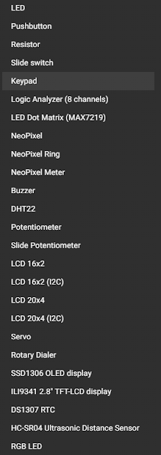

<pre>

</pre>
<pre>

  

Tecnológico Nacional de México
Instituto Tecnológico de Tijuana

Departamento de Sistemas y Computación
Ingeniería en Sistemas Computacionales

Semestre:
Febrero - Junio 2022

Materia:
Lenguajes de interfaz

Docente:
M.C. Rene Solis Reyes 

Unidad:
1

Título del trabajo:
Ejercicios Cierre Curso

Estudiante:
González Martínez Álvaro Gabriel - 19211651

	

</pre>

Conjunto de **[ejercicios](https://github.com/tectijuana/simuladorrp2040-Alvaroggm123/tree/main/code	 "Carpeta de código del repositorio.")** a realizar basados en la publicación del 26 de abril del 2022.

Los ejercicios propuestos a realizar están basados en la siguiente captura adjunta en la publicación del profesor.

  

## Lista de trabajos
### Semana 1:
- [x] [sisProg001](./code/sisProg001/ "Wokwi preview") -  Visualización en wokwi "Práctica [LED](https://wokwi.com/projects/330555368301134420	 "Wokwi preview práctica LED")".
- [x] [sisProg002](./code/sisProg002/ "Wokwi preview") -  Visualización en wokwi "Práctica [PushButton](https://wokwi.com/projects/330555556474389076	 "Wokwi preview práctica PushButton")".
- [x] [sisProg003](./code/sisProg003/ "Wokwi preview") -  Visualización en wokwi "Práctica [Resistor](https://wokwi.com/projects/330562844952101460	 "Wokwi preview práctica Resistor")".
- [x] [sisProg004](./code/sisProg004/ "Wokwi preview") -  Visualización en wokwi "Práctica [Slide Swich](https://wokwi.com/projects/330556478719001172	 "Wokwi preview práctica Slide Swich")".
- [x] [sisProg005](./code/sisProg005/ "Wokwi preview") -  Visualización en wokwi "Práctica [Keypad](https://wokwi.com/projects/330560001740374612		 "Wokwi preview práctica Slide Keypad")".
- [ ] sisProg006 -  Visualización en wokwi "Práctica [Logic analyzer](https://wokwi.com/projects/313706149095408193		 "Wokwi preview práctica Slide Analizador Logico")".
- [ ] sisProg007 -  Visualización en wokwi "Práctica MAX7219".
- [x] [sisProg008](./code/sisProg008/ "Wokwi preview") -  Visualización en wokwi "Práctica [NeoPixel](https://wokwi.com/projects/330573337453396562			 "Wokwi preview práctica Slide NeoPixel regular")".
- [x] [sisProg009](./code/sisProg009/ "Wokwi preview") -  Visualización en wokwi "Práctica [NeoPixel Ring](https://wokwi.com/projects/330573361281237586			 "Wokwi preview práctica Slide NeoPixel anillo")".
- [x] [sisProg010](./code/sisProg010/ "Wokwi preview") -  Visualización en wokwi "Práctica [NeoPixel Meter](https://wokwi.com/projects/330573651878347347	 "Wokwi preview práctica Slide NeoPixel medidor")".
- [x] [sisProg011](./code/sisProg011/ "Wokwi preview") -  Visualización en wokwi "Práctica [Buzzer](https://wokwi.com/projects/330573914707067475	"Wokwi preview práctica Buzzer")".
- [x] [sisProg012](./code/sisProg012/ "Wokwi preview") -  Visualización en wokwi "Práctica [DHT22](https://wokwi.com/projects/330575202851226195	"Wokwi preview práctica DHT22")".
- [x] [sisProg013](./code/sisProg013/ "Wokwi preview") -  Visualización en wokwi "Práctica [Potenciometro](https://wokwi.com/projects/330576746300572243	"Wokwi preview práctica Potenciometro")".
- [x] [sisProg014](./code/sisProg014/ "Wokwi preview") -  Visualización en wokwi "Práctica [Potenciometro Slider](https://wokwi.com/projects/330585417088762451	"Wokwi preview práctica Potenciometro slider")".
- [x] [sisProg015](./code/sisProg015/ "Wokwi preview") -  Visualización en wokwi "Práctica [LCD 16x2 - INO](https://wokwi.com/projects/330570339562029650	"Wokwi preview práctica Potenciometro LCD 16x2 con ino")".
- [x] [sisProg016](./code/sisProg016/ "Wokwi preview") -  Visualización en wokwi "Práctica [LCD 16x2 I2C](https://wokwi.com/projects/330586599288996434	"Wokwi preview práctica Potenciometro LCD 16x2 I2C")".
- [x] [sisProg017](./code/sisProg017/ "Wokwi preview") -  Visualización en wokwi "Práctica [LCD 20x4 - INO](https://wokwi.com/projects/330605352263352915	"Wokwi preview práctica Potenciometro LCD 20x4 con ino.")".
- [x] [sisProg018](./code/sisProg018/ "Wokwi preview") -  Visualización en wokwi "Práctica [LCD 20x4 I2C](https://wokwi.com/projects/330591087215247954	"Wokwi preview práctica Potenciometro LCD 20x4 con I2C.")".
- [x] [sisProg019](./code/sisProg019/ "Wokwi preview") -  Visualización en wokwi "Práctica [Servo](https://wokwi.com/projects/330591752851292754 "Wokwi preview práctica Servo motor.")".
- [ ] sisProg020 -  Visualización en wokwi "Práctica Rotary dialer".
- [x] [sisProg021](./code/sisProg021/ "Wokwi preview") -  Visualización en wokwi "Práctica [SSD1306](https://wokwi.com/projects/330604441635914322 "Wokwi preview práctica Servo motor.")".
- [ ] sisProg022 -  Visualización en wokwi "Práctica ILI9341".
- [x] [sisProg023](./code/sisProg023/ "Wokwi preview") -  Visualización en wokwi "Práctica [DS1307 RTC](https://wokwi.com/projects/330590027787534930	"Wokwi preview práctica Servo motor.")".
- [x] [sisProg024](./code/sisProg024/ "Wokwi preview") -  Visualización en wokwi "Práctica [HC SR04 Ultrasonic](https://wokwi.com/projects/330571582473765458	"Wokwi preview práctica del sensor ultrasonico.")".
### Semana 2:
- [x] [sisProg026](./code/sisProg026/ "Wokwi preview") -  Visualización en wokwi "Práctica [Display de 7](https://wokwi.com/projects/331189254099042899	"Wokwi preview práctica del sensor de display de 7 segmentos en un grupo de 4.")".
- [x] [sisProg027](./code/sisProg027/ "Wokwi preview") -  Visualización en wokwi "Práctica [Display de 7 segmentos x 4](https://wokwi.com/projects/331189387453792850	"Wokwi preview práctica del sensor de display de 7 segmentos en un grupo de 4.")".
- [x] [sisProg028](./code/sisProg028/ "Wokwi preview") -  Visualización en wokwi "Práctica [Barra de leds](https://wokwi.com/projects/331193887112561235	"Wokwi preview práctica del sensor de barra de leds.")".
- [x] [sisProg029](./code/sisProg029/ "Wokwi preview") -  Visualización en wokwi "Práctica [Joystick](https://wokwi.com/projects/331204805815960147	"Wokwi preview práctica del Joystick")".
- [x] [sisProg031](./code/sisProg031/ "Wokwi preview") -  Visualización en wokwi "Práctica [Sensór PIR](https://wokwi.com/projects/331223148853723732	"Wokwi preview práctica del sensor PIR.")".
- [x] [sisProg032](./code/sisProg032/ "Wokwi preview") -  Visualización en wokwi "Práctica [Temperatura](https://wokwi.com/projects/331223440323248723	"Wokwi preview práctica del sensor de Temperatura.")".
- [x] [sisProg035](./code/sisProg035/ "Wokwi preview") -  Visualización en wokwi "Práctica [Encoder (ampliación)](https://wokwi.com/projects/331225558882976338	"Wokwi preview práctica del encoder.")".
- [x] [sisProg039](./code/sisProg039/ "Wokwi preview") -  Visualización en wokwi "Práctica [LEDS RGB](https://wokwi.com/projects/331824369205510738	"Wokwi preview práctica de leds RGB.")".
- [x] [sisProg040](./code/sisProg040/ "Wokwi preview") -  Visualización en wokwi "Práctica [Fotoresistor](https://wokwi.com/projects/331824449358660179	"Wokwi preview práctica del sensor de luminocidad.")".
- [x] [sisProg041](./code/sisProg041/ "Wokwi preview") -  Visualización en wokwi "Práctica [Giro sensór](https://wokwi.com/projects/331838719399035474	"Wokwi preview práctica del sensor MPU6050.")".
- [x] [sisProg042](./code/sisProg042/ "Wokwi preview") -  Visualización en wokwi "Práctica [Barra de leds](https://wokwi.com/projects/331193887112561235	"Wokwi preview práctica del sensor de barra de leds.")".
- [x] [sisProg043](./code/sisProg043/ "Wokwi preview") -  Visualización en wokwi "Práctica [Barra de leds](https://wokwi.com/projects/331193887112561235	"Wokwi preview práctica del sensor de barra de leds.")".
- [x] [sisProg044](./code/sisProg044/ "Wokwi preview") -  Visualización en wokwi "Práctica [Barra de leds](https://wokwi.com/projects/331193887112561235	"Wokwi preview práctica del sensor de barra de leds.")".