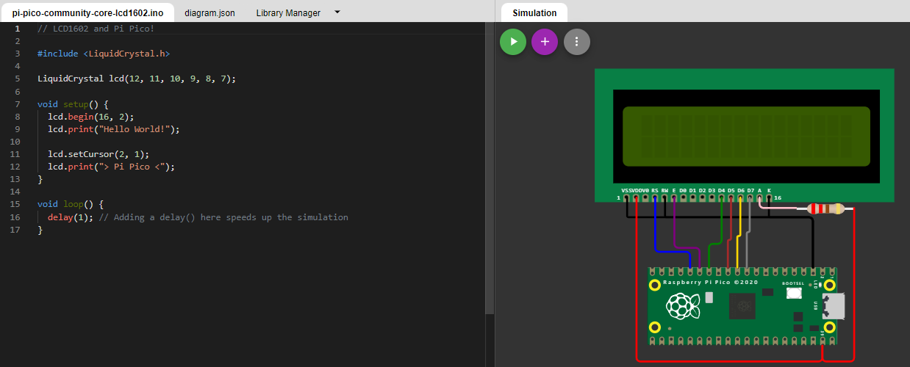

## sisProg017
### LCD con Pico

Por: [González Martínez Álvaro Gabriel](github.com/alvaroggm123)
 - ### [Loom de referencia](https://www.loom.com/share/27279e8aaef448bebe01c977cce0d2ff)

## Imagen del código y circuito implementado.

<pre>

 Captura de la simulación implementado en <a href="http://www.wokwi.com">Wokwi</a>.

</pre>

 <-- <a href="https://github.com/tectijuana/simuladorrp2040-Alvaroggm123/blob/main/code/sisProg016">Práctica anterior</a> |--| <a href="https://github.com/tectijuana/simuladorrp2040-Alvaroggm123">Menú principal</a> |--|<a href="https://github.com/tectijuana/simuladorrp2040-Alvaroggm123/blob/main/code/sisProg018">Siguiente práctica</a> --> 
