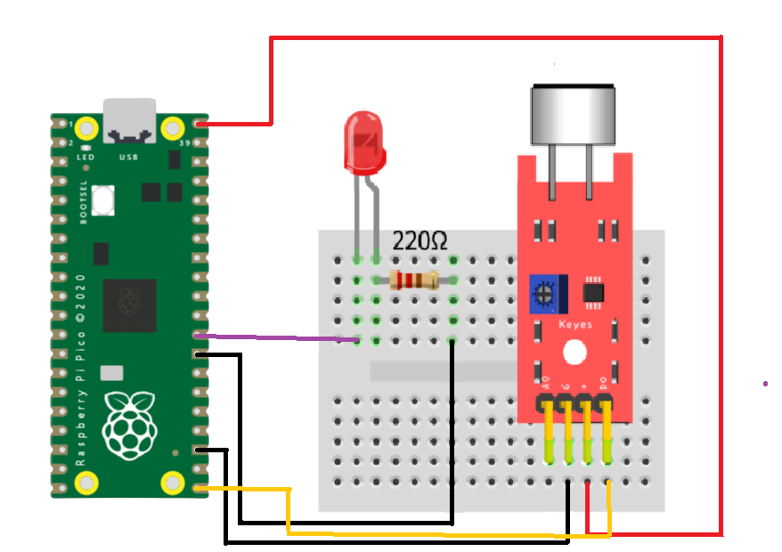

# Sensor KY-038 Small Sound

## ¿Que es?
El sensor de sonido KY-038 está diseñado con un pequeño micrófono electret que detecta las variaciones de ruido del ambiente. El sensor KY-038 tiene como característica que es altamente sensible, por lo que su sensor de micrófono de condensador electret (EC) permite detectar un mínimo ruido producido en el ambiente, cuenta con un LED indicadora de suministro de energía y por el otro extremo cuenta con otra que indica la salida. También permite obtener dos salidas, una análoga, que lleva toda la información que está detectando el micrófono y una digital que es una salida de encendido o apagado que se activa cuando el sonido supera un cierto volumen establecido por el potenciómetro.


## Especificaciones tecnicas 

| Voltaje de funcionamiento     | 5V DC                               |
|-------------------------------|-------------------------------------|
|Distancia máxima de inducción  | 0.5 metros                          |
|Chip principal                 |  LM393                              |
|Micrófono                      | Electret                            |
|Gama de frecuencias            | 100 – 10.000 Hz                     |
|Sensibilidad                   | – 46 ± 2,0, (0dB = 1V / Pa) a 1K Hz |
|La sensibilidad mínima a ruido | 58 dB                               | 
|Dimensiones                    | 36 x 15 x 15 mm                     | 
| Peso                          | 4g                                  |

## ¿Como funciona?

Este Sensor KY 038 puede detectar sonido, consiste en el funcionamiento de un detector de ondas sonoras, dichas ondas son recibidas en forma de energía y son enviadas mediante señal eléctrica hacia un aparato receptor/codificador.

Este sensor la señal que nos entrega es digital y analógica, lo cual nos permite decidir cuál utilizar según nuestras necesidades. Si necesitamos saber el valor del sensor, podremos utilizar directamente la salida analógica para conseguir los datos. Sino, podemos utilizar la salida digital, la cual se activa o se desactiva según si el sensor llega a medir la intensidad del sonido que le configuremos, mediante la definición de la sensibilidad del sensor.


## ¿Para que sirve?
Este sensor se piuede utilizar para proyectos que requieran la detección de ruido, como ser alarmas o interruptores con detección de voz o sonido (un aplauso por ejemplo).

## Diagrama

## Codigo
```python
# Martinez Estrada Ana Karen
# Revisado por Aquino Villegas Daniel

from machine import Pin
from utime import sleep

Sound = Pin (28, Pin.IN)
led = Pin(22,Pin.OUT)
clap_count=1

while True:
    led.value(1)
    if Sound.value()==1 and clap_count==1:
        led.value(1)
        Sound.value(0)
        sleep(0.50)
        
    if Sound.value()==1 and clap_count==2:
        led.value(0)
        clap_count=1
        Sound.value(0)
        sleep(0.5)
```
