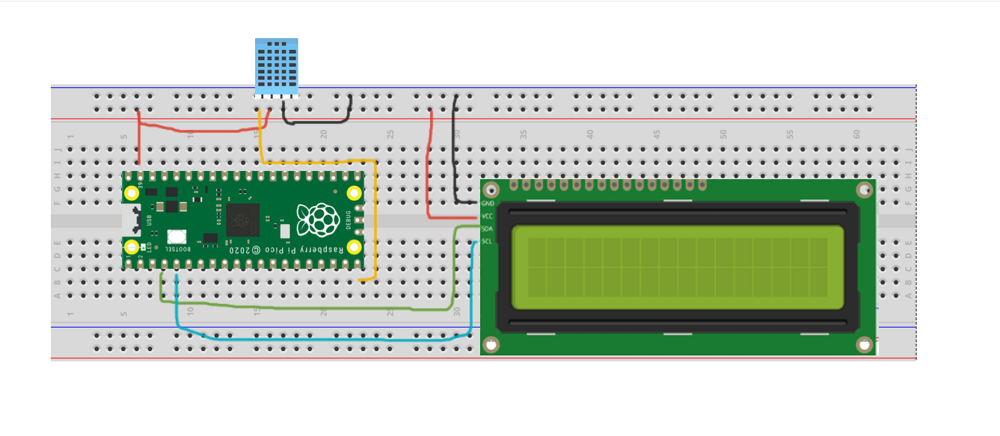

## Sobre Raspberry Pi Pico

Las Raspberry Pi son una especie de mini computadora (Single Board Computers, SBC), similares a los microcontroladores, pero mucho mas capaces. 
Originalmente se concibieron como una herramienta para enseñar a las personas sobre como funcionan las computadoras, a través de proyectos que varían en complejidad, sin embargo, a través del tiempo, se convirtieron en algo más, usandose en ambientes industriales, profesionales.

Ejemplos de cosas que se pueden hacer con una Raspberry:
- Controladores de robots
- Crear servidores web
- Monitoreo de clima

Una de las versiones mas recientes en el mercado de Raspberry Pi, es la Pico.
Es una SBC con un costo muy bajo (lanzó en 4 USD). Utiliza el microchip RP2040, cuenta con 264KB de RAM y 2MB de memoria no volátil
Se diseñó con el fin de cumplir el objetivo que las Pi originales tenían: ser una herramienta de enseñanza, ya que las especificaciones son muy limitadas. Se puede programar con los lenguajes de C, Micropython y Circuitpython.

## Sobre sensores

Un sensor es una pieza de hardware que tiene el objetivo de detectar eventos o cambios en el ambiente, captando la información, y luego pasarla a otros dispositivos para cumplir un objetivo

## KY-015 / DHT11 Temperature-Humidity sensor

Es un sensor que es capaz de detectar temperatura y humedad, que cuenta con las siguientes características operacionales:
- Voltaje: 3.3V to 5V
- Rango de temperatura a detectar: 32ºF a 122ºF( 0ºC a 50ºC)
- Certeza de medición de temperatura: ±2ºC
- Rango de humedad a detectar: 20% to 90% RH
- Dimensiones: .75in X 1.77in (2cm x 4.5cm)


## Descripción del trabajo
Vamos a hacer un circuito simple, utilizando la Raspberry Pi Pico y un sensor de temperatura-humedad DHT11. También vamos a hacer uso de un display OLED I2C de 16x2.
El objetivo del proyecto es sencillo: crear un circuito que sea capaz de leer la temperatura y humedad ambiente con el sensor, y desplegar esos valores en el display. Para esto, el Pi Pico se va a encargar de recibir los valores del sensor, correr un script continuamente para detectar la entrada, darle formato a los datos, y por último, darles salida con el OLED.

## Diagrama del circuito


## Código
El siguiente código es el driver principal para correr el programa. Ocupa de ciertas librerías que se cargaron en el Pico.
```python
# Importación de librerias, para el display OLED, la interfaz entre el I2C y Pi Pico,
# Controlar tiempos y para trabajar con el sensor, respectivamente
from pico_i2c_lcd import I2cLcd
from machine import Pin, I2C
from time import sleep
from dht import  DHT11

# Declarando que vamos a usar el Pin de nuestro RPI
pin = Pin(15)
dht11 = DHT11(pin,None,dht11=True)

#Declarando el uso de nuestra pantalla I2C OLED, incluyendo la frecuencia en bauds, y los Pins
i2c_lcd = I2C(id=1,scl=Pin(3),sda=Pin(2),freq=100000)

lcd = I2cLcd(i2c_lcd, 0x27, 2, 16)

while True:
    sleep(1)
    T,H = dht11.read() #Leyendo la temperatura y humedad
    if T is None:
        print("Conectar sensor") #Si no se detecta el sensor, tirar mensaje
    else:
        print("Temperatura :" + str(T) + "°C   "+ "Humedad:"+ str(H) +"%")
    # Este codigo es para imprimir en la pantalla
    lcd.move_to(0,0)
    lcd.putstr("Temperatura: " + str(T) + chr (0xDF) + "C")
    lcd.move_to(0,1)
    lcd.putstr("Humedad: "+ str(H) +"%")
    sleep(0.5)     
    
```

## Pruebas y ejecución
Estos son los primeros resultados de la ejecución del código anterior


