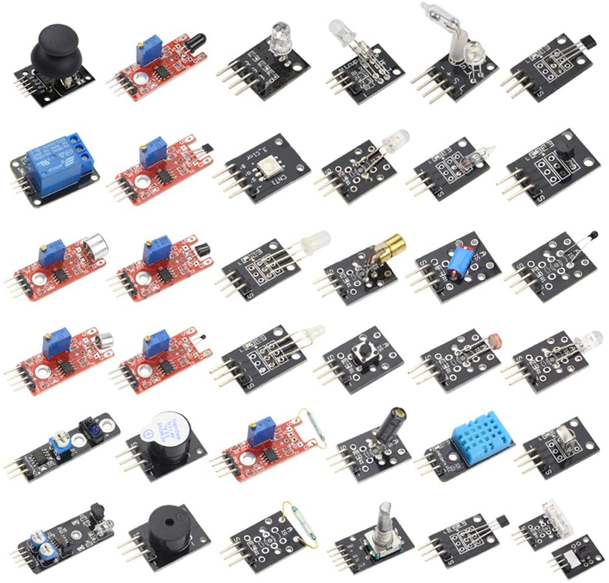
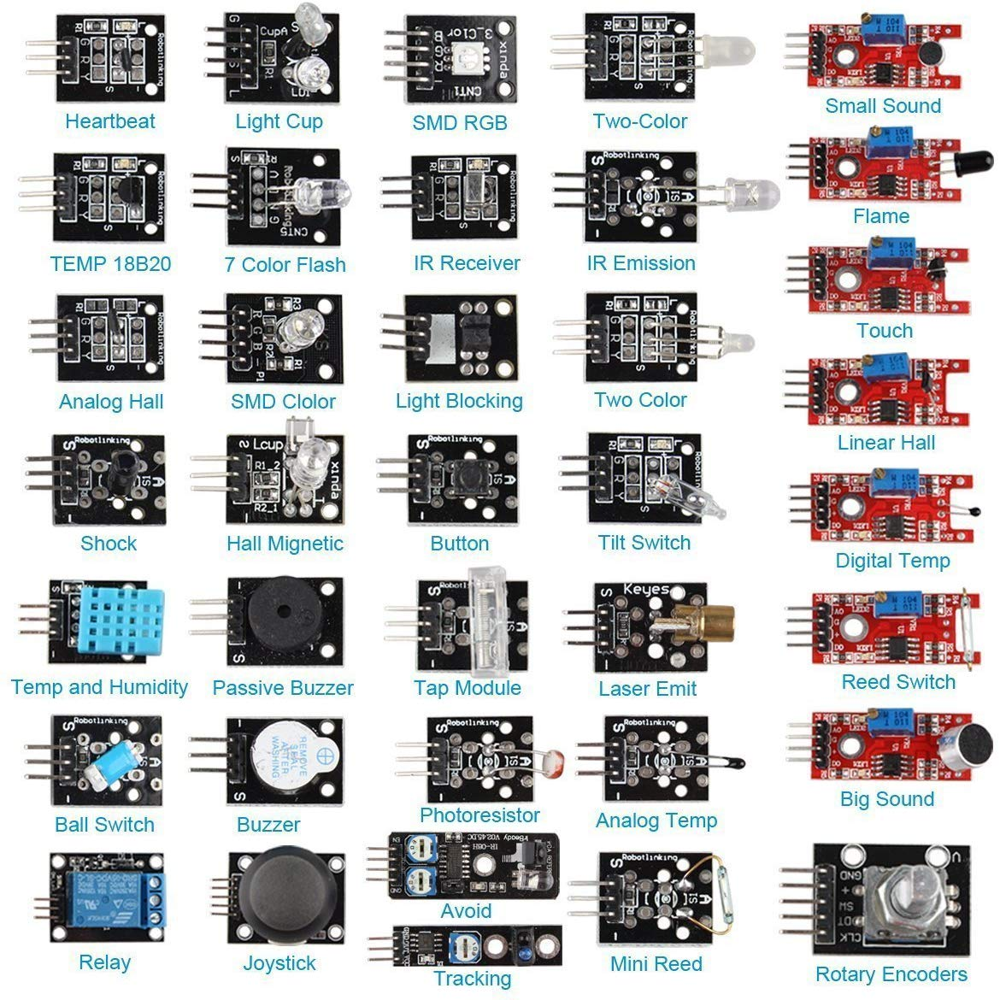
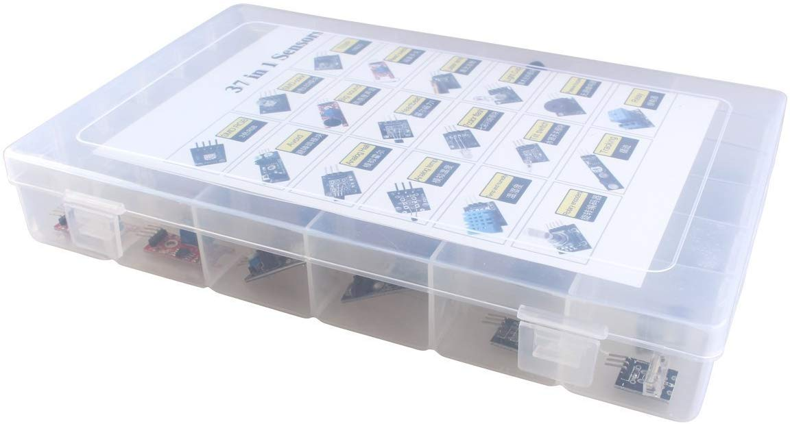
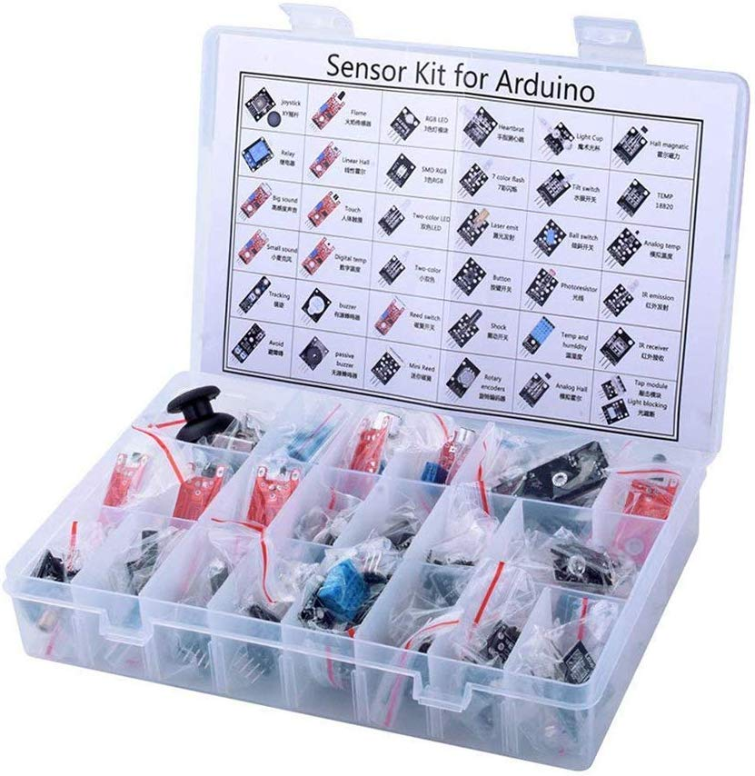

| Periodo         	| (2023) Enero-Junio                                                                                                                                                                                                                                                                                                                                                                                                                                                                                                                                                                                                                                                                                                                                                                                                                                                                                                                                                                                                                                                                                                                                                                                                                                                                                                                                                                  	|
|-----------------	|-----------------------------------------------------------------------------------------------------------------------------------------------------------------------------------------------------------------------------------------------------------------------------------------------------------------------------------------------------------------------------------------------------------------------------------------------------------------------------------------------------------------------------------------------------------------------------------------------------------------------------------------------------------------------------------------------------------------------------------------------------------------------------------------------------------------------------------------------------------------------------------------------------------------------------------------------------------------------------------------------------------------------------------------------------------------------------------------------------------------------------------------------------------------------------------------------------------------------------------------------------------------------------------------------------------------------------------------------------------------------------------	|
| Materia         	| SISTEMAS PROGRAMABLES                                                                                                                                                                                                                                                                                                                                                                                                                                                                                                                                                                                                                                                                                                                                                                                                                                                                                                                                                                                                                                                                                                                                                                                                                                                                                       	|
| Grupo           	|  SCC-1023SC7B                                                                                                                                                                                                                                                                                                                                                                                                                                                                                                                                                                                                                                                                                                                                                                                                                                                                                                                                                                                                                                                                                                                                                                                                                                                                                                                                                                 	|
| Caracterización 	| Esta asignatura aporta al perfil del Ingeniero en Sistemas Computacionales las siguientes habilidades: - Implementar aplicaciones computacionales para solucionar problemas de diversos contextos, integrando diferentes tecnologías, plataformas - Evaluar tecnologías de hardware para soportar aplicaciones de manera efectiva. - Coordinar y participar en equipos multidisciplinarios para la aplicación de soluciones innovadoras en diferentes contextos. - Diseñar e implementar interfaces para la automatización de sistemas de hardware y desarrollo del software asociado. Sistemas programables aporta la capacidad de diseñar e implementar interfaces hombre- máquina y máquina-máquina para la automatización de sistemas e integrar soluciones computacionales con diferentes tecnologías, plataformas o dispositivos. Para integrarla, se ha hecho un análisis de las materias Principios eléctricos y aplicaciones digitales, Arquitectura de computadoras y Lenguajes de interfaz; identificando los temas de electrónica analógica y digital, lenguajes de bajo nivel, programación de dispositivos y arquitecturas de cómputo. Esta asignatura se relaciona con las materias de inteligencia artificial y programación lógica y funcional respectivamente, más específicamente, los temas de robótica, visión artificial, programación lógica, entre otros. 	|
| Objetivos       	| Utilizar con precisión la terminología y simbología de microcontroladores e interfaces. Acoplar dispositivos de visualización, sensores y actuadores a microcontroladores Programar microcontroladores. Proponer aplicaciones de solución mediante el diseño de interfaces de hardware y software.                                                                                                                                                                                                                                                                                                                                                                                                                                                                                                                                                                                                                                                                                                                                                                                                                                                                                                                                                                                                                                                                                	|

| Unidad                                                     | Competencia Especifica                                                                                                                                                                                                                                                                                                    | Actividades de Aprendizaje                                                                                                                                                                                                                                                                                                                                                                                                                                        | Actividades de Enseñanza                                                                                                                                                                                                                                                                                    | Desarrollo de                                                                                                                                                                                                                                         | Horas  | Criterios de                                                                                                                                                                                                                                          | Fuentes                                                                                                                    | Apoyos Didacticos                                                                                                                                                                                              | Eval | Núm. | Sem. |
|------------------------------------------------------------|---------------------------------------------------------------------------------------------------------------------------------------------------------------------------------------------------------------------------------------------------------------------------------------------------------------------------|-------------------------------------------------------------------------------------------------------------------------------------------------------------------------------------------------------------------------------------------------------------------------------------------------------------------------------------------------------------------------------------------------------------------------------------------------------------------|-------------------------------------------------------------------------------------------------------------------------------------------------------------------------------------------------------------------------------------------------------------------------------------------------------------|-------------------------------------------------------------------------------------------------------------------------------------------------------------------------------------------------------------------------------------------------------|--------|-------------------------------------------------------------------------------------------------------------------------------------------------------------------------------------------------------------------------------------------------------|----------------------------------------------------------------------------------------------------------------------------|----------------------------------------------------------------------------------------------------------------------------------------------------------------------------------------------------------------|------|------|------|
|                                                            | De la Unidad                                                                                                                                                                                                                                                                                                              |                                                                                                                                                                                                                                                                                                                                                                                                                                                                   |                                                                                                                                                                                                                                                                                                             | Competencias Genéricas                                                                                                                                                                                                                                | TeoPra | Evaluación                                                                                                                                                                                                                                            |                                                                                                                            |                                                                                                                                                                                                                | Diag | Form | Suma |
| 01.Sensores                                                | - Aplica principios físicos y comprende transductores y sensores - Analiza y sintetiza la función de los sensores diversos y sus aplicaciones. - Aplica sensores de luz, temperatura y su relación con la variable mensurable - Organiza y clasifica información proveniente de fuentes diversas.                         | - Selecciona y resume conceptos básicos sobre transductores y los tipos de sensores. - Realiza mapa conceptual sobre los sensores en aplicaciones de sistemas programables. - Identifica los elementos importantes de un sensor y los expone en cuadro sinóptico. - Especifica mediciones de la variable mensurable en un sensor de luz.                                                                                                                          | Se elabora cuadro sinoptico sobre clasificacion de sensores, asi presentacion ante grupo sobre sensores y transductores opticos, temperatura, presion, proximidad (tipos, caracteristicas, modo de comunicacion, y ejemplos aplicativos), asi como practica electronica sobre sensores de temperatura y luz | Se aplica principos fisicos y comprension de sensores y tranductores, Se aplica teoria sobre sensores de opticos, temperatura, proximidad, presion, asi como practica de laboratorio de circuiteria electronica utilizando sensores temperatura y luz | 8      | Se aplica principos fisicos y comprension de sensores y tranductores, Se aplica teoria sobre sensores de opticos, temperatura, proximidad, presion, asi como practica de laboratorio de circuiteria electronica utilizando sensores temperatura y luz | Ficha bibliograficas (Sensores y actuadores), asi como material en fuentes expuestas en internet                           | Material de apoyo sobre electronica basica, y simuladores, fichas tecnicas sobre sensores opticos, temperatura, presion y proximidad asi como uso de componentes electronicos, proyeccciones, videos, ejemplos | 00   | 00   | 00   |
| 02.Actuadores                                              | - Aplica principios teóricos de electromagnetismo para analizar actuadores. - Identifica y diferencia los actuadores eléctricos, mecánicos e hidráulicos. - Explica con propiedad la función de los actuadores y el papel de estos en la industria. - Ensambla los circuitos respectivos empleando sensores y actuadores. | - Evalúa y presenta investigación sobre la relación de variables a controlar y la aplicación de los actuadores en la industria. - Realiza un cuadro comparativo de las características y usos de los actuadores eléctricos, electrónicos, mecánicos e hidráulicos. - Desarrolla una presentación sobre los usos de los actuadores en la vida cotidiana. - Programa microcontroladores con aplicaciones de sensores y actuadores y ensambla circuitos respectivos. | Se elabora mapa conceptual sobre usos de los actuadores neumatics, hidraulicos, se expone presentacion ante grupo sobre los actuadores electricos (ejemplos), asi como ensamble de circuiteria electronica con motores DC                                                                                   | Se aplica principos fisicos y comprension de actuadores hidraulicos y neumaticos, asi como se aplica teoria y practica de laboratorio de circuiteria electronica utilizando actuadores electricos, temporizadores y control de giro de motor DC       | 8      | Cada actividad de aprendizaje cuenta con una rubrica de evaluacion (Introduccion, desarrollo, conclusiones, bibliografias), utilizando el estilo IEEE y APA                                                                                           | Ficha bibliograficas (Actuadores Neumaticos, hidraulicos y electricos), asi como material en fuentes expuestas en internet | Material de apoyo sobre electronica basica, y simuladores, fichas tecnicas sobre componentes como actuadores electricos y uso de elementos electronicos, proyeccciones, videos, ejemplos                       | 00   | 00   | 00   |
| 03.Microcontroladores.                                     | - Identifica las características eléctricas de un microcontrolador. - Conoce la arquitectura interna del microcontrolador. - Comprende la estructura de registros del microcontrolador. - Analiza dispositivos de entrada/salida y puertos del microcontrolador.                                                          | - Realiza mapa conceptual del diseño interno de la arquitectura de los microcontroladores. - Investiga y expone sobre las aplicaciones de los microcontroladores. - Programa al microcontrolador con sus dispositivos de entrada/salida que sean adaptables.                                                                                                                                                                                                      | Se realiza evaluacion sobre la arquitectura de los microcontroladores, se elaborar una tabla comporativa entre familia de microcontroladores, y se introducen dos nuevos microcontroladores para practicas de laboratorio                                                                                   | Se identifican las caracteristicas, arquitectura interna, registros, entrada y salidas analogicas y digitales del microcontrolador,                                                                                                                   | 8      | Cada actividad de aprendizaje cuenta con una rubrica de evaluacion (Introduccion, desarrollo, conclusiones, bibliografias), utilizando el estilo IEEE y APA                                                                                           | Ficha bibliograficas, asi como material en fuentes expuestas en internet                                                   | Material de apoyo sobre electronica basica, y simuladores, fichas tecnicas sobre componentes como microcontroladores utilizados en la industria, proyeccciones, videos, ejemplos                               | 00   | 00   | 00   |
| 04.Programación de microcontroladores.                     | - Utiliza lenguajes ensambladores en la programación del microcontrolador. - Programa microcontroladores utilizando puertos de E/S. - Construye y comprueba circuitos con microcontrolador.                                                                                                                               | - Realiza una investigación sobre los modelos de programación de microcontroladores y elabora un cuadro comparativo. - Utiliza instrucciones más comunes en programas diversos que muestren el funcionamiento del microcontrolador. - Resuelve los ejercicios de programación propuestos.                                                                                                                                                                         | Se realiza evaluacion sobre la arquitectura de los microcontroladores, se elaborar una tabla comporativa entre familia de microcontroladores, y se introducen dos nuevos microcontroladores para practicas de laboratorio                                                                                   | Se identifican las caracteristicas, arquitectura interna, registros, entrada y salidas analogicas y digitales del microcontrolador,                                                                                                                   | 8      | Cada actividad de aprendizaje cuenta con una rubrica de evaluacion (Introduccion, desarrollo, conclusiones, bibliografias), utilizando el estilo IEEE y APA                                                                                           | Ficha bibliograficas, asi como material en fuentes expuestas en internet                                                   | Material de apoyo sobre electronica basica, y simuladores, fichas tecnicas sobre componentes como microcontroladores utilizados en la industria, proyeccciones, videos, ejemplos                               | 00   | 00   | 00   |
| 05.Puertos y buses de comunicación para microcontroladores | - Identifica y analiza los elementos esenciales de los puertos y buses de comunicación. - Implementa aplicaciones que impliquen el manejo de puertos y buses de comunicación.                                                                                                                                             | - Investigar la relación entre los diferentes puertos de comunicación y sus aplicaciones. - Mediante ejemplos, analiza el impacto de los buses de comunicación en la industria. - Realiza un programa que manipule datos sobre los buses de comunicación.                                                                                                                                                                                                         | Se ensambla y programan circuitos electronicos utilizando sensores de temperatura, encendido y apagado de un motor DC por medio de un relevador y el protocolo Wifi                                                                                                                                         | Se identifica y analiza elementos tales como puertos y buses de comunicaci�n, y aplicaciones sobre manejo de ellos                                                                                                                                  | 8      | Cada actividad de aprendizaje cuenta con una rubrica de evaluacion (Introduccion, desarrollo, conclusiones, bibliografias), utilizando el estilo IEEE y APA                                                                                           | Ficha bibliograficas, asi como material en fuentes expuestas en internet                                                   | Material de apoyo sobre electronica basica, y simuladores, fichas tecnicas sobre componentes como microcontroladores utilizados en la industria, proyeccciones, videos, ejemplos                               | 00   | 00   | 00   |
| 06.Interfaces                                              | - Conoce los diferentes módulos de adquisición de datos para su aplicación en el diseño de interfaces de sistemas programables. - Diseña y aplica interfaces hombre-máquina y máquina-máquina - Propone y/o explica soluciones y procedimientos de diseño de interfaces.                                                  | - Investiga la clasificación de las interfaces en los módulos de adquisición de datos. - Programa, ensambla componentes para desarrollar una interface hombre-máquina. - Implementa protocolos de comunicación en el diseño de la interface del sistema programable.                                                                                                                                                                                              | Se ensambla y programan interfaces visuales para adquisicion de datos, utilizando comunicaci�n Bluetooth, IR, utilizando un controlador de velocidad de motor DC, y controlador de un servomotor, sensores ultrasonicos, IR                                                                               | Se conoce los distintos modulos de adquisicion de datos para el dise�o de interfaces programables, asi como el dise�o y aplicaci�n de una interface hombre-maquina y maquina'maquina, haciendo uso de circuiteria electronica                   | 8      | Cada actividad de aprendizaje cuenta con una rubrica de evaluacion (Introduccion, desarrollo, conclusiones, bibliografias), utilizando el estilo IEEE y APA                                                                                           | Ficha bibliograficas, asi como material en fuentes expuestas en internet                                                   | Material de apoyo sobre electronica basica, y simuladores, fichas tecnicas sobre componentes como microcontroladores utilizados en la industria, proyeccciones, videos, ejemplos                               | 00   | 00   | 00   |

