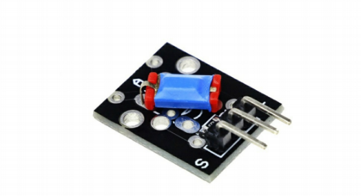

## Descripcion

The tilt switch module known as KY 0 20. This is a module itself. So
let's get started. Today's video is brought to you by all our gv s and
an online store where you can find shirts, jeans and cool accessories
that fit your needs. All the products are made in Italy, they can be
shipped worldwide, so don't waste your time start looking fancy
today with their stock. For more information, go to RGV SM sharp
dot net or check it out at the link on the video description. This
module has integrated on board, a tilt switch, and one resistor, the
resistor using this module it's on and the main reason for using the
resistor is to limit currency collating inside the module.

In other words to prevent current from burning our modal. Now, I
will show how these components are connected together. There we
have the sensor itself, and of course, the resistor r1. On the right, you
can see how the piece of the module are connected on this board. So
we have inlet the flow of the voltage we have in black, the flow of
the ground, and of course, we have in game the flow of the signal.
This sensor has inside a metal egg bowl that opens or closes the
sacred step. panting.
The angle of the tilt the sensor it's normally have, but to under
sensor, it's tilted in that way that the ball shorts to conduct the sensor
turns on. Even that the sensor detects changes when it's tilted, it is
actually very basic and cannot measure the angle of the tilt. Let's talk
about the pins. The pins in this module
