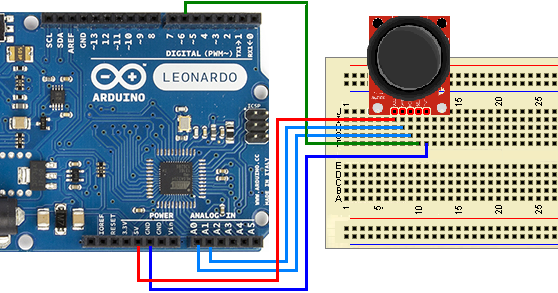

<a href="http://cooltext.com" target="_top"></a>


***Información***

El módulo Joystick KY-023 permite capturar los movimientos de tu dedo, de tal forma que puedes controlar tu proyecto de manera muy similar a un videojuego. En realidad un joystick es un arreglo físico de 2 potenciómetros que permite conocer la posición exacta de la palanca en los “Ejes X e Y”, por lo que solamente requerimos de 2 pines analógicos para realizar la interfaz con cualquier microcontrolador. El Módulo Joystick posee también un “Eje Z” que no es otra cosa más que un botón que cierra el circuito al presionar la palanca, este se puede conectar a cualquier otro pin digital o analógico. El módulo facilita en gran medida la conexión del dispositivo a un microcontrolador como Arduino, ya que se pueden utilizar cables para conectarlo sin la necesidad de soldar, todas las conexiones se encuentran convenientemente señaladas para facilitar las tareas.


***Ficha Tecnica***

| Voltaje de Operación     |             5V DC             |
|--------------------------|:-----------------------------:|
|      Numero de ejes      |            2 (X -Y)           |
| Numero de potenciometros |           2 * 10Kohm          |
|          Modelo          |             KY-023            |
|      Numero de Pines     | 5 (GND, +5V DC, VRx, VRy, SW) |



***Codigo**

```java
// Arduino pin numbers
const int SW_pin = 2; // digital pin connected to switch output
const int X_pin = 0; // analog pin connected to X output
const int Y_pin = 1; // analog pin connected to Y output

void setup() {
  pinMode(SW_pin, INPUT);
  digitalWrite(SW_pin, HIGH);
  Serial.begin(250000);
}

void loop() {
  Serial.print("Switch:  ");
  Serial.print(digitalRead(SW_pin)*500);
  Serial.print(" ");
  Serial.print("X-axis: ");
  Serial.print(analogRead(X_pin));
  Serial.print(" ");
  Serial.print("Y-axis: ");
  Serial.println(analogRead(Y_pin));
  Serial.print("\n");
}
```
